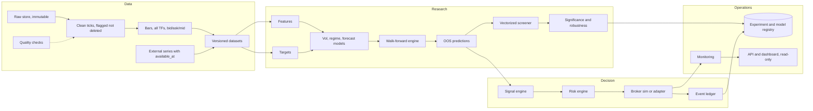
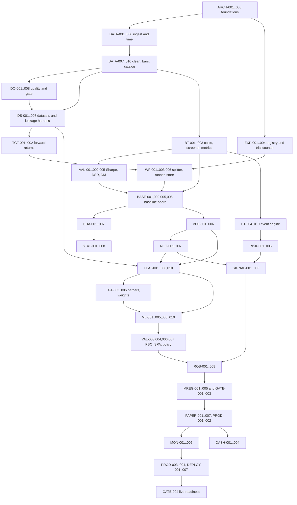

# XAUUSD Quant Research Platform — Development Plan

Sep 26, 2026 · @Shubhang

## 1. Scope and conventions

This plan turns the XAUUSD research specification into 26 phases, about 180 backlog tasks and 16 sprints that Claude Code can execute in order. Phase numbers describe the logical architecture. The sprint plan (section 10) is the build order, and it deliberately builds the validation machinery before any research is run.

The plan does not assume an edge exists. Phases 4–11 are research gates: each can end in a documented rejection, and the project is allowed to stop at "research platform + negative result".

### Task types

- **E — Engineering:** builds a component. Done when its tests pass and it is documented.
- **R — Research:** runs a pre-registered experiment. Done when the report and registry entry exist, including when the hypothesis is rejected. A rejected hypothesis is a completed task, not a failed one.
- **V — Validation:** a gate, statistical test or harness. Done when it demonstrably rejects a bad candidate on synthetic data.

**Priority:** P0 blocks the critical path · P1 required for the release gate · P2 valuable, deferrable · P3 only if evidence justifies it.

**Complexity:** S (under half a day) · M (1–2 days) · L (3–5 days) · XL (over a week; must be split before starting).

### Binding time conventions

These apply to every module. Violating any of them is treated as a leakage bug.

1. All timestamps are stored in UTC as int64 nanoseconds and handled as tz-aware values in pandas.
2. A bar covers the half-open interval \[bar\_start, bar\_start + Δ). Every bar carries `available_at = bar_start + Δ + publication_latency`. Nothing may be used before its `available_at`.
3. Decision time t is the `available_at` of the latest base-timeframe bar. Features at t use only rows with `available_at ≤ t`.
4. Execution happens at the first quote at or after t + latency, on the correct side: buy at ask, sell at bid.
5. The trading day rolls at 17:00 America/New\_York (FX and metals convention). Daily bars follow that roll.
6. Sessions are defined in local exchange time zones and converted to UTC per date, so DST is handled by construction.
7. Targets, stops and thresholds are expressed in volatility units (multiples of σ̂ known at t) or basis points, never fixed dollar amounts.

**Naming:** Python package `xq` (import root `src/xq`), CLI `xq`.

### Owner decisions with defaults

The plan proceeds on these defaults. Change them before Sprint 1 if they are wrong, because several affect the data layer.

| Decision | Default used in this plan | Why it matters |
| --- | --- | --- |
| Primary research feed | The execution broker's own tick bid/ask history; Dukascopy only as an optional secondary long-history source, stored separately | Bars, spreads and timestamps match the venue you trade; check history depth first, since the plan needs about 4–5 years |
| Execution venue for paper and live | A retail CFD broker with an API (MT5, OANDA or cTrader), to be named | Costs, spreads, financing and server-time conventions must match where you trade |
| Account currency | USD | P&L and financing conversion |
| Research horizon focus | 15 minutes to 1 day | Sub-15-minute directional edges rarely survive retail costs; tested explicitly in EDA-006 |
| Risk budget | 0.5% equity risk per trade, trading halt at 15% drawdown | Drives sizing, Monte Carlo gates and risk limits |
| Vault (untouchable holdout) | The most recent 12 months at project start, plus all later data | Protects the final out-of-sample test |

## 2. Assumptions likely to cause problems

The biggest risk is not a missing model. It is building research on a feed, clock or evaluation loop that silently disagrees with how you will trade. These 16 assumptions in the brief are the most likely to hurt; each lists the alternative this plan adopts.

1. **"Tick data with bid/ask" is a single truth.** Spot XAUUSD is OTC with no consolidated tape. Dukascopy, your broker and COMEX GC futures print different prices, spreads and "volume". Tick volume is a feed artifact.
   - *Adopted:* one declared primary feed per dataset version, recorded in provenance. The primary feed is the execution broker's own bid/ask history. A long-history feed (e.g. Dukascopy) may cover earlier years only as a separate source (DATA-013), never spliced silently into broker bars; DATA-011 measures its basis against the broker feed. Tick volume enters features only after it proves stable across feeds.
2. **Broker server time is UTC.** MT4/MT5 exports usually use server time (commonly UTC+2 / UTC+3, shifting with US DST). Misreading it shifts every session feature by two or three hours.
   - *Adopted:* every adapter declares its clock convention. A test locates the weekly open, weekly close and 17:00 New York rollover gap at the expected UTC hour on both sides of each DST change.
3. **Phase order equals build order.** Running EDA, statistics and ML (Phases 4–11) before the walk-forward engine, cost model and experiment registry (Phases 12–18) produces early results without the machinery that would reject them and without a trial count.
   - *Adopted:* a thin evaluation spine (splitter, costs, vectorized backtest, metrics, registry, trial counter) is built in Sprints 3–4, before any research sprint.
4. **Walk-forward OOS stays out-of-sample.** Each time you look at walk-forward results and adjust, those periods leak into design decisions. After dozens of iterations they are in-sample.
   - *Adopted:* a locked vault that the data loader refuses to serve without a gate token. It is opened once per candidate at the release gate, and every opening is logged. Paper trading is the second, forward vault.
5. **More methods mean more chances to find edge.** About 30 model types × 6 target types × 7 timeframes × dozens of features guarantees impressive false positives.
   - *Adopted:* hypotheses are pre-registered with a trial budget. Every configuration evaluated on a test fold increments a trial counter that feeds the deflated Sharpe ratio and SPA tests. Model families unlock in order of simplicity.
6. **One-minute bars are a sensible prediction horizon.** For retail XAUUSD, round-trip cost is a large fraction of the typical one-minute move, so even a genuine one-minute edge is usually consumed.
   - *Adopted:* EDA-006 computes the cost-to-volatility ratio (round-trip cost ÷ expected absolute move) per horizon and session. Horizons above a configured bound (default 0.3) are excluded from directional research. One-minute data is still used for execution simulation, realized volatility and entry timing.
7. **The full production stack is needed from day one.** PostgreSQL/TimescaleDB, Redis, FastAPI and service containers before any edge exists add cost and slow research.
   - *Adopted:* research tier = partitioned Parquet + DuckDB + SQLite metadata through SQLAlchemy/Alembic (portable to Postgres). TimescaleDB, FastAPI and optional Redis arrive with paper trading. The code stays a modular monolith with explicit interfaces until then.
8. **One event-driven backtester for everything.** It is the right reference but too slow for thousands of walk-forward fits and perturbations.
   - *Adopted:* a vectorized screener for research plus an event-driven reference simulator for candidates, with a reconciliation test (BT-009) requiring agreement on shared strategies.
9. **OHLC bars can resolve stops and targets.** When both lie inside one bar, OHLC cannot say which came first; optimistic resolution inflates results.
   - *Adopted:* resolve with ticks when available, otherwise assume the stop was hit first. Report the share of ambiguous bars in every backtest.
10. **Regime models are causal by default.** HMM smoothed probabilities, Viterbi paths and offline change-point methods (PELT, binary segmentation) use future data. HMM state labels also permute between refits.
    - *Adopted:* only forward-filtered probabilities become features, refit inside each fold, with states ordered by fitted variance. Offline change points are descriptive only; online BOCPD is the only change-point feature allowed.
11. **External macro data is just another column.** FRED yields and TIPS real yields are daily, published with a lag and sometimes revised. DXY is a licensed ICE index with its own hours. VIX trades different hours.
    - *Adopted:* every external series carries `available_at` from its publication schedule, first-release vintages are used where revisions exist, and each series must pass an incremental out-of-sample test (FEAT-009) before admission.
12. **Dollar thresholds are stable.** Gold's price level has changed several-fold over usable history, so a fixed $2 stop or $0.50 spread filter means different things in different years.
    - *Adopted:* volatility-unit or basis-point parameters only (convention 7).
13. **Research and trading code can differ.** If paper trading re-implements features or signals, it drifts from the backtest.
    - *Adopted:* one strategy runtime with pluggable data sources (replay, live) and brokers (simulated, paper, live). Shadow replay parity is a test (PAPER-005).
14. **Costs are static.** XAUUSD spreads widen sharply around the 17:00 New York rollover, the Sunday open and major US releases. CFD positions held overnight pay financing.
    - *Adopted:* spread from data per tick or bar, with an hour-of-week fallback model; slippage scaled by volatility and session; financing charged at rollover; configurable news-window blackouts or cost multipliers.
15. **There is enough regime diversity for deep learning.** Gold's drivers shifted over the sample, including the widely reported weakening of the gold–real-yield link after 2022. The number of independent regimes is small however many rows exist.
    - *Adopted:* sequence models are P3 and unlock only if tabular models show significant signal and learning curves show data is not the bottleneck.
16. **Model confidence and Kelly can drive size.** Kelly is extremely sensitive to estimation error, and raw model scores are not probabilities.
    - *Adopted:* Kelly is a diagnostic only. Sizing is fixed-fractional risk scaled by calibrated probability, capped at the configured maximum. Calibration is mandatory before any probability reaches the signal engine.

Two further structural choices follow from these. EDA runs only on a **discovery window** (the first 50–60% of non-vault data), so hypotheses generated by looking at data are tested on later folds. And there is an explicit **stop condition**: if no candidate passes gate R2 by Sprint 13, the project delivers a negative-result report and the paper-trading sprints become optional infrastructure work.

## 3. Target architecture and repository layout

The system is a modular monolith: one library (`xq`) with four layers — data, research, decision, operations — that communicate through versioned files and a metadata database until paper trading. Only then do a few components become separate services (Phase 23).



### Technology choices

| Concern | Choice | Justification |
| --- | --- | --- |
| Python and environment | Python 3.12, `uv` with lockfile | Fast, reproducible installs; one lockfile hash recorded per run |
| Dataframes | pandas 2.x with pyarrow, NumPy, SciPy | Native interop with statsmodels, arch, scikit-learn; Polars only if ingest profiling demands it |
| Time-series storage (research) | Parquet partitioned by date, queried with DuckDB | Columnar, immutable files, no server |
| Metadata | SQLite via SQLAlchemy 2 + Alembic | Same models migrate to Postgres at paper trading |
| Live storage | PostgreSQL + TimescaleDB (Sprint 14+) | Hypertables for live ticks, bars and decisions |
| Statistics | statsmodels, arch, scipy | Standard, well-tested implementations |
| ML | scikit-learn, LightGBM, Optuna; hmmlearn; PyTorch only if Stage D unlocks | Add each dependency in the sprint that needs it |
| Config | pydantic v2 + pydantic-settings + YAML | Typed, validated, hashable |
| Logging | structlog, JSON lines | Machine-parsable, run id and git sha on every line |
| Tests | pytest, hypothesis, pytest-cov | Property tests for bars, accounting and splits |
| Quality | ruff, mypy (strict on core modules), pre-commit, gitleaks |  |
| CLI | typer | One entry point `xq` |
| API and UI (late) | FastAPI read-only API, Streamlit dashboard | Visualization only, never the source of truth |
| Containers | Docker, compose profiles research / paper / prod |  |

### Repository layout

```text
xauusd-quant/
  pyproject.toml  uv.lock  .python-version  README.md  CHANGELOG.md  CLAUDE.md
  config/
    base.yaml  dev.yaml  research.yaml  paper.yaml  prod.yaml
    instruments/xauusd.yaml      # tick size, contract size, venue overrides
    sessions.yaml                # sessions, rollover, event anchors
    quality.yaml                 # DQ thresholds
    costs/<venue>.yaml           # spread fallback, commission, slippage, financing
    gates.yaml                   # evidence thresholds, fixed before results
  docs/
    adr/                         # architecture decision records
    specs/                       # this plan, project instructions, interface specs
    data/                        # provenance notes, quality reviews
    research/                    # hypotheses backlog, research log, reports index
    runbooks/
  experiments/
    hypotheses/H-0001.yaml       # pre-registered hypotheses
    configs/                     # experiment and strategy configs
  src/xq/
    core/        config.py logging.py time.py types.py ids.py seeds.py errors.py
    data/        adapters/ raw_store.py normalize.py clean.py bars.py calendar.py sessions.py catalog.py provenance.py
    quality/     checks/ registry.py report.py gate.py
    datasets/    spec.py asof.py primitives.py builder.py vault.py leakage.py
    features/    base.py registry.py price.py momentum.py volatility.py structure.py time.py liquidity.py mtf.py external.py diagnostics.py
    targets/     base.py returns.py volatility.py excursion.py barrier.py weights.py
    research/    eda/ stats/ volatility/ regimes/ reports.py
    models/      base.py baselines.py linear.py trees.py nn/ calibration.py persistence.py hpo.py
    validation/  splitters.py walkforward.py predictions.py forecast_eval.py sharpe.py dsr.py pbo.py spa.py multiple_testing.py
    backtest/    costs.py vectorized.py metrics.py events.py engine.py broker_sim.py portfolio.py ledger.py reconcile.py report.py
    risk/        state.py sizing.py limits.py stops.py engine.py kill_switch.py
    signals/     schema.py ev.py filters.py engine.py
    robustness/  perturb.py costs_stress.py bootstrap.py montecarlo.py noise.py slicing.py delay.py report.py
    tracking/    models.py hypotheses.py runs.py trials.py conclusions.py reproduce.py
    registry/    models.py bundles.py gates.py
    runtime/     strategy_runtime.py clock.py adapters/ paper_broker.py shadow_replay.py
    monitoring/  metrics.py data_health.py drift.py trading_health.py alerts.py
    api/         (FastAPI, late)
    dashboard/   (Streamlit, late)
    cli/         main.py and one module per command group
  migrations/                    # Alembic
  tests/  unit/ integration/ property/ leakage/ fixtures/
  reports/                       # generated, git-ignored except index
  data/                          # git-ignored
  docker/  docker-compose.yml  .env.example  .github/workflows/ci.yml
```

### Data directory layout

```text
data/
  raw/<source>/<instrument>/<yyyy>/<mm>/<original files>        # read-only after ingest, sha256 in manifest
  raw_parquet/<source>/<instrument>/year=YYYY/month=MM/day=DD/   # faithful mirror + raw_file_id, row_num
  clean/<source>/<instrument>/rules=<ver>/year=.../               # canonical ticks + flag bitmask
  bars/<source>/<instrument>/tf=<tf>/build=<ver>/year=.../
  external/<series>/vintage=<date>/
  datasets/<dataset_id>/{features.parquet, targets.parquet, spec.yaml, manifest.json}
  predictions/<experiment_id>/<run_id>/
  artifacts/<experiment_id>/<run_id>/
```

The vault is not a separate directory. It is a date cutoff (`vault.start` in config) enforced in the catalog loader, so it cannot be bypassed by reading a different folder through the library.

## 4. Phases 0–5: foundations, data and descriptive research

Each phase uses the same 15 fields. Task IDs refer to the backlog in section 9, which holds priority, complexity and dependencies per task.

### Phase 0 — Project architecture

- **Objective:** a reproducible, typed, tested repository with configuration, logging, CLI and CI that every later phase plugs into.
- **Why:** reproducibility and leakage control are properties of the codebase, not of notebooks. They must exist before the first dataset.
- **Dependencies:** none.
- **Tasks and subtasks:**
  - ARCH-001 Scaffold: `src/` layout, `pyproject.toml` managed by uv, `.python-version` 3.12, README, CHANGELOG (Keep a Changelog), `CLAUDE.md` with the binding invariants, `docs/adr/0001-record-architecture-decisions.md`.
  - ARCH-002 Quality tooling: ruff lint and format, mypy strict on `core`, `data`, `datasets`, `validation`, `backtest`, `risk`; pre-commit; pytest markers `unit`, `integration`, `property`, `leakage`, `slow`, `research`.
  - ARCH-003 Configuration: pydantic-settings models; precedence base.yaml → profile yaml → `XQ_` environment variables → CLI overrides; frozen config object passed explicitly (no module-level mutable state); `config_hash()` over the canonical JSON; secrets typed as `SecretStr`.
  - ARCH-004 Logging: structlog JSON to file and console; `run_id`, `git_sha`, `config_hash` bound to every line.
  - ARCH-005 Core utilities: `Timeframe` enum with durations, `Side`, UTC conversion helpers, `trading_day(ts)` with 17:00 New York roll, ULID ids, `set_global_seed()` for random/NumPy (and torch if installed).
  - ARCH-006 CLI skeleton: `xq --version`, `xq config show` (secrets masked), empty command groups for later phases.
  - ARCH-007 CI: GitHub Actions running ruff, mypy, and pytest (unit + leakage) with `TZ=Asia/Tokyo` to catch hidden local-time dependencies.
  - ARCH-008 Docker: dev image (python-slim + uv), compose `research` profile, `.env.example`.
- **Inputs:** this plan.
- **Outputs:** installable `xq` package, green CI, `xq config show` prints the resolved configuration.
- **Files:** `pyproject.toml`, `uv.lock`, `src/xq/core/*.py`, `src/xq/cli/main.py`, `config/*.yaml`, `tests/unit/core/*`, `.github/workflows/ci.yml`, `.pre-commit-config.yaml`, `docker/Dockerfile`, `docker-compose.yml`.
- **Database changes:** none.
- **Interfaces:** `load_config(profile: str, overrides: Mapping | None = None) -> AppConfig`; `get_logger(name: str) -> BoundLogger`; `config_hash(cfg: AppConfig) -> str`; `trading_day(ts: pd.Timestamp) -> date`.
- **Tests:** config precedence; hash stable under key reordering; secrets never printed; `trading_day` at 16:59/17:00/17:01 New York on DST-change weeks in March and November; seeded draws identical across runs.
- **Acceptance:** fresh clone → `uv sync && uv run pytest` green; CI green; `docker compose --profile research run --rm xq xq --version` works.
- **Research validation:** not applicable.
- **Failure conditions:** global mutable config; any test that passes only in the developer's local timezone.
- **Not yet:** database servers, API, dashboard, ML libraries.

### Phase 1 — Market data infrastructure

- **Objective:** ingest XAUUSD tick bid/ask into an immutable raw store, derive flagged clean ticks and bid/ask/mid bars on seven timeframes, all traceable to source files.
- **Why:** every later result inherits the data's errors, and timestamp errors look like signal.
- **Dependencies:** Phase 0.
- **Tasks and subtasks:**
  - DATA-001 Instrument spec in `config/instruments/xauusd.yaml`: symbol, tick size 0.01, contract size per venue (commonly 100 oz per lot on CFDs; confirm per broker), quote currency, lot step, min/max lot, rollover time, per-venue overrides.
  - DATA-002 Calendar and sessions: weekly open Sunday 17:00 New York, weekly close Friday 17:00 New York, daily break around 17:00–18:00 New York (venue-configurable), US and UK holidays and early closes. Sessions in local time: Tokyo 09:00–18:00 Asia/Tokyo, London 08:00–17:00 Europe/London, New York 08:00–17:00 America/New\_York; London–New York overlap derived. Event anchors: LBMA gold price auctions 10:30 and 15:00 London, COMEX open 08:20 New York, US data releases 08:30 New York, rollover. Output: a per-trading-day session table in UTC.
  - DATA-003 `SourceAdapter` protocol plus the primary adapter for the execution broker's tick or bar export (MT5, cTrader or OANDA), including its server-time convention. The adapter declares `source_id`, clock convention, price type and column mapping, and returns the file's content unmodified.
  - DATA-004 Raw store: copy originals to `data/raw/...`, set read-only, compute sha256, insert `raw_files`; mirror to Parquet with `raw_file_id` and `row_num`; re-ingesting the same sha256 is a no-op.
  - DATA-005 Metadata database and Alembic migrations (schema below).
  - DATA-006 Timestamp normalization to UTC using the adapter's declared convention; flag DST-ambiguous and non-existent local times; enforce ordering within each file.
  - DATA-007 Non-destructive cleaning: rules set bits in a `flags` bitmask — `DUP_EXACT`, `DUP_TS_DIFF_PRICE`, `NONPOSITIVE`, `CROSSED`, `SPREAD_OUTLIER`, `SPIKE` (robust z on mid returns via rolling MAD, confirmed by reversal within k ticks), `CLOSED_MARKET`, `STALE`. Default action is flag only; `drop` is allowed only for exact duplicates, non-positive and crossed quotes, per config. Every action is logged with original values. Rules are versioned.
  - DATA-008 Bar builder: from clean ticks build bid, ask and mid OHLC on 1m; `tick_count`, spread mean/median/max/close, `n_flagged`; half-open intervals labelled by start with `available_at`; empty minutes produce no bar (no forward fill) and a row in a gaps table. 5m/15m/30m/1h aggregate from 1m aligned to UTC; 4h and 1d align to the 17:00 New York trading-day start (documented in an ADR). Incomplete in-progress bars carry `is_complete = false`.
  - DATA-009 Spread statistics per hour-of-week (p50, p90, p99) per source, used by the cost-model fallback.
  - DATA-010 Catalog loaders over DuckDB: `load_ticks`, `load_bars`; enforce the vault cutoff.
  - DATA-011 Cross-feed consistency (P2): basis distribution, lead–lag cross-correlation and gap mismatch between two feeds at 1m.
  - DATA-012 Vendor-bar ingestion path (P2) for bar-only feeds, marking spread as unknown.
  - DATA-013 Secondary long-history adapter (e.g. Dukascopy), used only if broker history is too short: stored under its own source id, never merged into broker bars, basis documented by DATA-011.
- **Inputs:** vendor files; instrument, session and venue config.
- **Outputs:** raw store, clean ticks, bars for 7 timeframes × {bid, ask, mid}, gaps table, spread statistics, provenance rows.
- **Files:** `src/xq/data/{adapters/,raw_store,normalize,clean,bars,calendar,sessions,catalog,provenance}.py`, `config/{instruments/xauusd,sessions}.yaml`, `migrations/versions/*`, `tests/unit/data/*`, `tests/property/test_bars.py`, `tests/fixtures/ticks/*`.
- **Database changes (metadata DB):**
  - `data_sources(source_id PK, vendor, feed_type, venue, price_type, clock_convention, notes)`
  - `instruments(instrument_id PK, symbol, tick_size, contract_size, quote_ccy, lot_step, min_lot, max_lot, venue)`
  - `ingest_runs(run_id PK, started_at, finished_at, status, git_sha, config_hash, params_json)`
  - `raw_files(raw_file_id PK, source_id FK, instrument_id FK, path, original_name, sha256 UNIQUE, bytes, row_count, first_ts_utc, last_ts_utc, ingest_run_id FK, ingested_at)`
  - `clean_partitions(partition_id PK, source_id, instrument_id, trading_day, rules_version, raw_file_ids JSON, row_count, flagged_count, dropped_count, sha256)`
  - `cleaning_actions(action_id PK, partition_id FK, rule_id, ts_utc, action, reason, original_values_json)`
  - `bar_sets(bar_set_id PK, source_id, instrument_id, timeframe, basis, clean_rules_version, build_version, start_utc, end_utc, row_count, sha256)`
  - `bar_gaps(bar_set_id FK, gap_start_utc, gap_end_utc, expected_open BOOL)`
  - `spread_stats(source_id, instrument_id, hour_of_week, p50, p90, p99, n, computed_from, computed_to)`
- **Parquet schemas:** clean ticks `ts_utc int64, bid, ask, bid_size?, ask_size?, flags uint32, raw_file_id, row_num`; bars `bar_start_utc, available_at_utc, o/h/l/c for bid, ask and mid, tick_count, spread_mean, spread_med, spread_max, spread_close, n_flagged, trading_day, is_complete`.
- **Interfaces:** `SourceAdapter.discover(path) -> list[RawFileRef]`, `.read(ref) -> pd.DataFrame`, `.to_canonical(df) -> TickFrame`; `build_bars(ticks, tf, basis, rules) -> BarFrame`; `load_bars(source, instrument, tf, basis, start, end, *, allow_vault=False) -> BarFrame`.
- **Tests:** fixture parsing; server-time conversion across both DST changes; raw files cannot be modified; idempotent re-ingest; property tests (high ≥ max(open, close), low ≤ min(open, close), ask ≥ bid at close); 5m from 1m equals 5m from ticks; no bar contains a tick at or after its `available_at`; daily boundaries at 17:00 New York in DST weeks; cleaning flags deterministic.
- **Acceptance:** one year of sample ticks ingests; bars rebuild bit-identically from raw with the same rules version; any bar can be traced to its raw files.
- **Research validation:** hour-of-week spread profile shows the rollover spike at 17:00 New York; weekly gap sits at the expected UTC hour; findings noted in `docs/data/provenance.md`.
- **Failure conditions:** any modification of raw files; timestamps off by hours around DST; forward-filled bars treated as observations.
- **Not yet:** external data, features, live feeds.

### Phase 2 — Data quality and validation

- **Objective:** automated, threshold-driven checks producing pass/warn/fail results per partition, plus a readable report and a gate that blocks bad partitions from datasets.
- **Why:** a spike or a shifted session can create a spurious edge; checks must flag, not repair.
- **Dependencies:** DATA-005, DATA-007, DATA-008.
- **Tasks and subtasks:**
  - DQ-001 Framework: `Check` protocol with id, scope (tick, bar, partition), severity and `evaluate(frame, ctx) -> CheckResult(metric, threshold, status, details)`; registry; thresholds in `config/quality.yaml`.
  - DQ-002 Tick checks: ordering, duplicates, non-positive, crossed, spread outliers vs hour-of-week p99, spikes, stale runs during active sessions, tick-rate anomalies.
  - DQ-003 Bar checks: OHLC consistency, missing minutes in session, duplicate bar starts, extreme returns in robust σ, zero-range bars in active sessions, bid/ask/mid consistency.
  - DQ-004 Calendar checks: data during closed market, missing data during open market, holiday behaviour, weekly gap location.
  - DQ-005 Feed-consistency checks built on DATA-011 (P2).
  - DQ-006 Report: summary table, per-check statistics, top anomalies with timestamps, missing-minutes heatmap (week × hour), spread heatmap (hour-of-week); stored in `quality_reports` and `reports/quality/<run_id>/`.
  - DQ-007 Gate: the dataset builder refuses FAIL partitions unless explicitly excluded (exclusion recorded); WARN partitions are listed in the dataset manifest.
  - DQ-008 Initial human review of the top 20 anomalies per check, written to `docs/data/quality-review-<date>.md`.
- **Default thresholds** (`config/quality.yaml`, changed only with an ADR note):

| Check | Warn | Fail |
| --- | --- | --- |
| Missing 1m bars in active sessions, per trading day | > 1% | > 5% |
| Duplicate timestamps with different prices | > 0.1% of ticks | > 1% |
| Crossed or non-positive quotes | any | > 0.01% |
| Spread above 10× hour-of-week median | > 0.1% | > 1% |
| Reverting spikes above 8 robust σ | > 5 per day | > 50 per day |
| Stale quote over 120 s in London or New York session | any | > 30 min per day |
| OHLC inconsistency | — | any |
| Ticks while market closed | any | > 0.1% |

- **Inputs:** clean ticks, bars, calendar.
- **Outputs:** `quality_reports` rows, HTML/Markdown report, gate decisions.
- **Files:** `src/xq/quality/{checks/,registry,report,gate}.py`, `config/quality.yaml`, `tests/unit/quality/*`.
- **Database changes:** `quality_runs(run_id PK, scope, source_id, start_utc, end_utc, git_sha, config_hash, created_at)`; `quality_results(run_id FK, partition_id, check_id, severity, metric_value, warn_threshold, fail_threshold, status, details_json)`.
- **Interfaces:** `run_checks(scope, frames, ctx) -> QualityRun`; `gate_partitions(run) -> GateDecision(included, excluded, warnings)`; CLI `xq validate --source --start --end`.
- **Tests:** each check on synthetic frames with injected defects detects exactly those defects; a clean fixture passes every check.
- **Acceptance:** `xq validate` produces a report for the sample year; the gate blocks a partition with an injected OHLC error.
- **Research validation:** DQ-008 review completed and threshold choices justified in writing.
- **Failure conditions:** any check that alters data; thresholds tuned after seeing strategy results.
- **Not yet:** online monitoring (Phase 21 reuses these checks).

### Phase 3 — Research dataset engine

- **Objective:** declarative, versioned, leakage-safe datasets of features and targets built from bars.
- **Why:** a dataset id must pin exactly what data, code and configuration produced a result.
- **Dependencies:** Phases 1 and 2.
- **Tasks and subtasks:**
  - DS-001 `DatasetSpec` (pydantic): source, instrument, base timeframe, price basis, start, end, context timeframes, feature-set name and version, target-set name and version, external series, exclusions, vault policy. `dataset_id = hash(spec + code version of builders)`.
  - DS-002 `asof_join(left, right, on_left="decision_time", on_right="available_at", tolerance)`: backward join on availability, never on bar start.
  - DS-003 Causal primitives: trailing rolling, expanding and EWM statistics; log, simple and vol-normalized returns; realized volatility; resampling helpers. Centered windows are banned (test plus a grep-based lint check for `center=True`).
  - DS-004 Vault: loaders raise `VaultAccessError` for data after `vault.start` unless given a gate token from GATE-002.
  - DS-005 Builder and versioning: materialize features and targets separately to `data/datasets/<id>/` with `manifest.json` (row count, range, sha256, git sha, spec, quality run ids, excluded partitions).
  - DS-006 Leakage harness applied to every feature and target: (a) truncation invariance, f(data up to t) at t equals f(full data) at t, for random t; (b) future perturbation, randomizing data after t leaves values at or before t unchanged; (c) availability audit, each row's inputs have `available_at ≤ decision_time`; (d) suspicious-correlation scan, any feature with |corr| above 0.9 to a target at lag 0 fails pending review.
  - DS-007 Calendar columns known in advance: trading day, session flags, minutes since session open, overlap flag, minutes to the next LBMA auction, US 08:30 release window, rollover.
- **Inputs:** bars, calendar, quality runs.
- **Outputs:** versioned datasets and manifests.
- **Files:** `src/xq/datasets/{spec,asof,primitives,builder,vault,leakage}.py`, `tests/leakage/*`, `tests/unit/datasets/*`.
- **Database changes:** `dataset_versions(dataset_id PK, spec_json, spec_hash, feature_set_version, target_set_version, bar_set_ids JSON, quality_run_ids JSON, start_utc, end_utc, row_count, sha256, git_sha, created_at)`.
- **Interfaces:** `build_dataset(spec: DatasetSpec) -> DatasetRef`; `load_dataset(dataset_id, part="features"|"targets") -> pd.DataFrame`; pytest fixture `assert_causal(fn, data)`.
- **Tests:** rebuilding a spec reproduces the sha256; the harness catches five planted leaks (centered rolling mean, full-sample z-score, `bfill`, higher-timeframe join on bar start, target shifted into features).
- **Acceptance:** `xq dataset build experiments/configs/ds_base.yaml` produces a dataset and manifest; vault access without token raises.
- **Research validation:** not applicable; this phase is infrastructure for validity.
- **Failure conditions:** any full-sample normalization; any join keyed on bar start instead of availability.
- **Not yet:** feature library beyond primitives (Phase 8).

### Phase 4 — Exploratory quantitative research

- **Objective:** reproducible description of XAUUSD returns, volatility, seasonality and costs, generated by code into versioned reports.
- **Why:** it sets priors, rules out horizons where costs dominate, and produces hypotheses to pre-register. It describes; it does not search for strategies.
- **Dependencies:** Phase 3, EXP-003, BT-001 (cost model for EDA-006).
- **Tasks and subtasks:**
  - EDA-001 Report framework: Python modules produce Markdown + PNG through a `ReportBuilder`; optional Jupytext notebooks may only import library code; reports saved with config and git sha; discovery-window enforcement.
  - EDA-002 Distributions at 1m to 1d: mean, volatility, skew, kurtosis with bootstrap CIs; Jarque–Bera; QQ plots against normal and fitted Student-t; Hill tail index; stability by year.
  - EDA-003 Dependence: ACF/PACF of returns, absolute and squared returns up to one trading day of lags, with heteroskedasticity-robust bands (not the iid ±1.96/√N bands).
  - EDA-004 Seasonality: hour-of-week mean return, absolute return, tick count and spread; day-of-week; month; session; LBMA auction windows; US release windows. Each effect with size, corrected CI and split-half stability.
  - EDA-005 Trend and reversion descriptives: variance ratios by horizon (descriptive only), run lengths, buy-and-hold drawdowns, time under water.
  - EDA-006 Cost-to-volatility table by horizon and session, producing the horizon admission list.
  - EDA-007 Distribution stability: rolling moments, two-sample KS and Anderson–Darling between years.
- **Inputs:** discovery-window dataset.
- **Outputs:** `reports/eda/<run_id>/`, `docs/research/hypotheses-backlog.md`.
- **Files:** `src/xq/research/eda/*.py`, `src/xq/research/reports.py`, `tests/unit/research/test_eda_stats.py`.
- **Database changes:** none beyond experiment registry rows.
- **Interfaces:** CLI `xq research eda --dataset <id>`.
- **Tests:** statistics match scipy/statsmodels on known inputs; report build deterministic on a fixture dataset.
- **Acceptance:** one command regenerates every table and figure.
- **Research validation:** every seasonal effect reported with effect size, multiple-comparison-corrected CI and split-half consistency; unstable effects labelled as such.
- **Failure conditions:** EDA touches data outside the discovery window; hypotheses tested on the same window that generated them.
- **Not yet:** strategy backtests.

### Phase 5 — Statistical time-series research

- **Objective:** formal tests of stationarity, dependence, memory and linear predictability, each ending with a written verdict.
- **Why:** these tests decide which transformations and model classes are worth pursuing, and many will say "not useful".
- **Dependencies:** Phase 4; WF-002 and VAL-005 for out-of-sample forecasting tasks.
- **Tasks and subtasks:**
  - STAT-001 Stationarity battery: ADF (AIC lag selection), KPSS (level and trend), Phillips–Perron, Zivot–Andrews (one break) on log price, log returns and log realized volatility; joint interpretation table.
  - STAT-002 Dependence: Ljung–Box on returns, absolute and squared returns at several lags; ARCH-LM.
  - STAT-003 Variance-ratio tests: Lo–MacKinlay heteroskedasticity-robust and Chow–Denning joint test, horizons 2–64 bars, by session and volatility regime.
  - STAT-004 Long memory: R/S and DFA Hurst estimates with bands from shuffled and phase-randomized surrogates; GPH or local Whittle d; on returns and absolute returns.
  - STAT-005 Fractional differencing (fixed-width window) on log price: smallest d passing ADF and its correlation with the original series; a candidate feature transform only.
  - STAT-006 AR, ARMA and ARIMA forecasts inside walk-forward at admitted horizons, compared with zero-return and random-walk forecasts by Diebold–Mariano. SARIMA only if EDA-004 found a stable daily cycle.
  - STAT-007 Multivariate (P3, gated on FEAT-009): ARIMAX with lagged external returns; VAR with Granger tests; Johansen cointegration, and VECM only if cointegration is found and stable across subperiods.
  - STAT-008 Verdict report in the Observed / Evidence / Interpretation / Limitations / Action format.

| Method | Question it answers | Use when | Useful evidence | Misuse to avoid |
| --- | --- | --- | --- | --- |
| ADF / PP | Unit root present? | Choosing level vs return modelling | Joint reading with KPSS | Treating non-rejection as proof of a unit root |
| KPSS | Stationarity around level or trend? | Paired with ADF | ADF rejects and KPSS does not | Using alone |
| Zivot–Andrews | Unit root allowing a break? | Long samples with regime shifts | Break date stable across subsamples | Many searches for breaks |
| ACF / PACF / Ljung–Box | Linear serial dependence? | Before any AR model | Significant with robust bands, stable across years | iid bands on heteroskedastic returns |
| ARCH-LM | Volatility clustering? | Before GARCH | Strong rejection (expected) | Reading it as return predictability |
| Variance ratio | Trending or reverting at horizon k? | Momentum and reversion hypotheses | Robust statistic significant after joint test, stable OOS | Testing many k without joint correction |
| Hurst / DFA / d | Long memory? | Only to justify FIGARCH or fractional differencing | Outside surrogate bands | Treating H ≠ 0.5 in-sample as tradable |
| Fractional differencing | Stationarity with memory preserved | Level-based features | Improves OOS model loss | Choosing d on the test period |
| AR / ARMA / ARIMA | Linear forecastability | Dependence found above | DM test beats random walk OOS after costs of trading | Reporting in-sample coefficients as edge |
| VAR / VECM | Cross-asset dynamics | External series admitted | Granger and cointegration stable across subperiods | Mixing series with different availability times |

- **Inputs:** discovery-window and walk-forward datasets.
- **Outputs:** `reports/stats/<run_id>/`, registry entries, verdict report.
- **Files:** `src/xq/research/stats/{stationarity,dependence,variance_ratio,memory,fracdiff,arima,multivariate}.py`.
- **Database changes:** registry rows only.
- **Interfaces:** each test returns a typed result (statistic, p-value, lags, assumptions, verdict).
- **Tests:** recovery on simulated processes before any gold run — random walk (ADF does not reject), AR(1) with φ = 0.5 recovered, GARCH series (Ljung–Box on squares rejects), fractional Gaussian noise with H = 0.7 inside CI, Ornstein–Uhlenbeck (variance ratio below 1).
- **Acceptance:** every method passes its recovery test; every run has a registry entry and verdict.
- **Research validation:** useful evidence means significant out-of-sample improvement (DM p < 0.05 after Holm adjustment across horizons) that is large relative to the cost-to-volatility ratio. In-sample significance alone is recorded but never promoted.
- **Failure conditions:** testing dozens of lag/session combinations without correction; fitting on vault or test periods.
- **Not yet:** nonlinear and ML models.

## 5. Phases 6–11: modelling research

### Phase 6 — Volatility research

- **Objective:** find which estimators and forecasters best predict realized variance out-of-sample at each admitted horizon.
- **Why:** volatility is far more forecastable than direction. It feeds sizing, stops, barrier targets, regimes and cost scaling, so it is the most likely durable component.
- **Dependencies:** DS-003, STAT-002, WF-002, VAL-005, EXP-003.
- **Tasks and subtasks:**
  - VOL-001 Range estimators: close-to-close, Parkinson, Garman–Klass, Rogers–Satchell, Yang–Zhang (handles rollover and weekend gaps), Wilder ATR. All trailing; price basis configurable.
  - VOL-002 Realized measures: RV from 1m and 5m returns per hour and per trading day; bipower variation and jump component; intraday diurnal factor estimated on the training window only, for deseasonalizing.
  - VOL-003 Benchmarks: rolling RV, EWMA with λ fixed in advance (0.94, 0.97), HAR-RV (daily/weekly/monthly components; an intraday variant with hourly/daily/weekly).
  - VOL-004 GARCH family with `arch`: GARCH(1,1), GJR-GARCH, EGARCH with normal, Student-t and skewed-t errors; on daily returns and on deseasonalized hourly returns; FIGARCH only if STAT-004 found long memory in absolute returns. Refit per fold; multi-step forecasts.
  - VOL-005 Evaluation: target is realized variance over the forecast horizon; QLIKE (primary, robust to a noisy proxy) and MSE on variance; Mincer–Zarnowitz regressions; DM tests against HAR; Model Confidence Set at 90%; broken down by session and volatility regime.
  - VOL-006 `VolForecaster` interface and promotion of the winner (or EWMA/HAR if nothing beats them) as the platform's σ̂ source.
- **Inputs:** bars at 1m, 5m, 1h, 1d.
- **Outputs:** volatility model board; selected forecaster; σ̂ series per fold.
- **Files:** `src/xq/research/volatility/{estimators,realized,benchmarks,garch,evaluate}.py`, `src/xq/models/volatility.py`.
- **Database changes:** none (registry rows).
- **Interfaces:** `VolForecaster.fit(bars_train) -> Self`; `.predict(bars_upto_t, horizon) -> pd.Series[sigma_hat]` indexed by decision time.
- **Tests:** estimators match hand computations; on simulated GARCH data the fitted model recovers parameters within tolerance; the diurnal factor is computed from training data only (perturbing test data leaves it unchanged).
- **Acceptance:** all models evaluated on identical folds with identical targets; results registered.
- **Research validation:** a model is promoted only if it is in the 90% MCS and beats EWMA with DM p < 0.05; otherwise the simpler benchmark stays.
- **Failure conditions:** evaluating in-sample fitted variance; full-sample diurnal factors; comparing models on different folds.
- **Not yet:** implied volatility (GVZ, the Cboe gold ETF volatility index) unless admitted through FEAT-009.

### Phase 7 — Market regime detection

- **Objective:** determine whether causally estimated regimes change the conditional distribution of forward returns or strategy P&L out-of-sample.
- **Why:** strategies may work only in some states; a regime model is only valuable if it improves a downstream decision.
- **Dependencies:** VOL-006, BASE-005, WF-002.
- **Tasks and subtasks:**
  - REG-001 Rule baselines: volatility regime from the percentile of σ̂ using training-fold cut-offs; trend regime from Kaufman efficiency ratio, ADX and the t-statistic of a rolling regression slope; compression/expansion from short/long volatility ratio and band-width percentile.
  - REG-002 HMM (`hmmlearn`) with Gaussian emissions on \[return, log RV, log range\], 2–4 states chosen by BIC inside the training fold; forward-filtered probabilities only; states ordered by variance to fix labels; expected duration reported.
  - REG-003 Markov-switching regression with switching variance (statsmodels) on 4h and daily returns; filtered probabilities only.
  - REG-004 Change points (P3): online Bayesian change-point detection as a causal feature; offline PELT/binary segmentation only for a descriptive structural-break report.
  - REG-005 Clustering (P3): Gaussian mixture or k-means on standardized volatility/trend features, fitted on training folds, assigned by `predict` on test.
  - REG-006 Evaluation framework: (a) conditional forward-return distributions across regimes (Kruskal–Wallis, KS) with block-bootstrap p-values; (b) baseline-strategy OOS P&L by regime; (c) regime persistence versus holding period; (d) stability via adjusted Rand index of labels on overlapping periods between consecutive folds; (e) detection lag around known volatility events.
  - REG-007 Export: `RegimeModel.filter(bars_upto_t) -> DataFrame[p_state_k, state, regime_age]`, registered as features.
- **Inputs:** bars, σ̂, baseline strategy returns.
- **Outputs:** regime board; admitted regime features.
- **Files:** `src/xq/research/regimes/{rules,hmm,markov_switching,changepoint,clustering,evaluate}.py`, `src/xq/models/regime.py`.
- **Database changes:** none (registry rows).
- **Interfaces:** `RegimeModel.fit(train) -> Self`; `.filter(data) -> DataFrame` (causal); `.states() -> list[StateDescription]`.
- **Tests:** on a simulated two-state switching process, filtered probabilities recover the states with known accuracy; truncation invariance of filtered output; label ordering stable across refits.
- **Acceptance:** every regime model evaluated with REG-006 on identical folds.
- **Research validation:** a statistical regime model is accepted only if it improves a downstream OOS decision metric beyond the simple volatility-percentile rule, with a bootstrap CI excluding zero.
- **Failure conditions:** smoothed probabilities or Viterbi paths used as features; regimes defined after inspecting P&L.
- **Not yet:** risk-on/risk-off regimes from external data before FEAT-009 admits it.

### Phase 8 — Feature engineering

- **Objective:** a registry of causal, versioned, tested features from bars and admitted external series, with multi-timeframe context joined by availability.
- **Why:** features are the most common source of leakage and of overfitting; the framework must make both hard.
- **Dependencies:** DS-002, DS-006, VOL-001.
- **Tasks and subtasks:**
  - FEAT-001 Framework: `FeatureSpec(name, version, family, timeframe, params, lookback, warmup, inputs)`; pure `compute(bars) -> Series`; registry; named feature sets with versions; a parametrized pytest that runs DS-006 on every registered feature automatically.
  - FEAT-002 Price structure: log returns over 1, 2, 4, 8, 16, 32, 64 bars; range/σ̂; body/range; upper and lower wick ratios; gap since previous close (rollover and weekend); distance to rolling max/min in σ units; position within range; distance to session VWAP (tick-count weighted, with the tick-volume caveat) and to EMAs.
  - FEAT-003 Momentum: ROC, Wilder RSI, MACD histogram / σ̂, moving-average slope t-statistics, multi-horizon sign agreement.
  - FEAT-004 Volatility: selected estimators, short/long volatility ratios, volatility of volatility, σ̂ from VOL-006 fitted per fold, range expansion.
  - FEAT-005 Market structure: N-bar breakout distance in σ; efficiency ratio; ADX; swing highs and lows available only after their confirmation delay; mean-reversion z-score; compression percentile; distance to prior-day and prior-session high/low; distance to round-number levels in σ.
  - FEAT-006 Time: cyclical hour/minute, day of week, session one-hot, overlap flag, minutes to or from LBMA auctions, US releases and rollover.
  - FEAT-007 Tick volume and liquidity (gated): tick count relative to its hour-of-week norm, spread level and change; admitted only if DATA-011 shows cross-feed stability or research and execution use the same feed.
  - FEAT-008 Multi-timeframe context: selected features computed on 15m, 1h, 4h and 1d bars and joined to the base timeframe with `asof_join` on `available_at`.
  - FEAT-009 External data and admission test (P2): candidate series — EURUSD or a constructed USD index from FX feeds, US 2y and 10y yields, 10y TIPS real yield, VIX, GVZ, and a historical economic calendar if a source with release timestamps exists. Each series gets `available_at` from its publication schedule. Admission requires, on identical folds, significant OOS improvement of the with-series model over the without-series model (DM p < 0.05) in at least two thirds of folds.
  - FEAT-010 Diagnostics: missingness, per-feature stationarity, correlation clustering (distance 1 − |ρ|), within-fold permutation importance on validation data, clustered importance, importance stability across folds.
- **Normalization rule:** no global scalers. Either scalers fitted on each training fold, or trailing rolling z-scores.
- **Inputs:** bars, σ̂, regime outputs, admitted external series.
- **Outputs:** feature set v1 (and later versions) materialized through DS-005.
- **Files:** `src/xq/features/*.py`, `tests/leakage/test_all_features.py`, `tests/unit/features/*`.
- **Database changes:** `feature_sets(name, version, spec_json, hash, created_at)`; `external_series(series_id, source, frequency, publication_rule, vintage_policy, licence_note)`.
- **Interfaces:** `register_feature(spec, fn)`; `compute_feature_set(name, version, bars_by_tf, context) -> DataFrame`.
- **Tests:** every feature passes truncation-invariance and future-perturbation tests; a synthetic test proves a higher-timeframe value appears only after that bar's `available_at`; swing features show the confirmation lag.
- **Acceptance:** feature set v1 registered, all leakage tests green, diagnostics report produced.
- **Research validation:** features are not selected on test folds; importance is reported only when stable across folds.
- **Failure conditions:** any feature failing the harness; external series joined by date rather than availability.
- **Not yet:** automated feature search or deep feature learning.

### Phase 9 — Target engineering

- **Objective:** a library of forward-looking targets with explicit horizons, execution-aware prices and label end times, stored separately from features.
- **Why:** the target defines what "edge" means; a target measured from the signal bar's close instead of the achievable fill price overstates results.
- **Dependencies:** DS-005, VOL-006 (σ̂ for scaling; EWMA until then).
- **Tasks and subtasks:**
  - TGT-001 Framework: `TargetSpec(name, horizon, price_ref, params)`; outputs `value`, `label_start` (execution time), `label_end` (used for purging); stored in `targets.parquet`; a schema guard rejects any target column in a feature matrix.
  - TGT-002 Forward returns: log return from the execution price at t + latency (next ask for longs, next bid for shorts; mid variant for symmetric research) to t + h. Default horizons 15m, 1h, 4h, 1d, restricted to those admitted by EDA-006. Vol-normalized variant r / σ̂\_t.
  - TGT-003 Future realized volatility over (t, t + h\].
  - TGT-004 Maximum favourable and adverse excursion over the horizon in σ units, using the exit side of the quote.
  - TGT-005 Triple-barrier labels: take-profit a·σ̂\_t, stop b·σ̂\_t, vertical barrier h; label +1 / −1 / 0 with time to hit; side-specific; same-bar hits resolved with ticks or pessimistically and flagged.
  - TGT-006 Derived labels and weights: sign, |r| above k·σ̂, trade/no-trade (expected net P&L after costs positive), label concurrency and average-uniqueness sample weights.
- **Inputs:** clean ticks or 1m bid/ask bars, σ̂.
- **Outputs:** target sets with `label_end`.
- **Files:** `src/xq/targets/*.py`, `tests/unit/targets/*`.
- **Database changes:** `target_sets(name, version, spec_json, hash, created_at)`.
- **Interfaces:** `compute_targets(spec, quotes, sigma_hat) -> DataFrame[value, label_start, label_end, ...]`.
- **Tests:** synthetic price paths with known barrier hit times; the only information at or before t used by a target is σ̂\_t; `label_end` correct; bid/ask side correct for each direction.
- **Acceptance:** target set v1 materialized for every admitted horizon.
- **Research validation:** class balance, label autocorrelation and effective independent sample size reported per horizon; horizons with fewer than 1,000 effectively independent labels are flagged as underpowered.
- **Failure conditions:** targets using the signal bar close as entry; fixed-dollar barriers.
- **Not yet:** meta-labels (ML-008).

### Phase 10 — Baseline models

- **Objective:** a benchmark board that every candidate must beat on identical folds, costs and metrics.
- **Why:** without strong baselines, any model looks good.
- **Dependencies:** WF-002, BT-002, BT-003, TGT-002.
- **Tasks and subtasks:**
  - BASE-001 Forecast baselines: zero return, random walk, expanding historical mean, training-fold class frequency (climatology) for classification.
  - BASE-002 Rule strategies with parameters fixed in advance: buy-and-hold with financing; random entry matched to the candidate's trade count and holding-time distribution (1,000 seeds as a null distribution); time-series momentum; z-score mean reversion; MA crossovers (20/50, 50/200); Donchian/ATR breakout; volatility-targeted versions of each.
  - BASE-003 Statistical baselines from STAT-006 and VOL-003.
  - BASE-004 L2 logistic regression on at most 10 fixed features (multi-horizon returns, volatility ratio, session), calibrated.
  - BASE-005 Baseline board runner: all baselines through walk-forward and the standard cost model, stored per target, horizon and timeframe.
  - BASE-006 Forecast evaluation metrics: log loss, Brier, expected calibration error, reliability curves, AUC (secondary), MSE/MAE, QLIKE; per-observation loss series for DM tests.
- **Inputs:** datasets, costs, splitter.
- **Outputs:** baseline board.
- **Files:** `src/xq/models/baselines.py`, `src/xq/validation/forecast_eval.py`, `experiments/configs/baselines/*.yaml`.
- **Database changes:** registry rows.
- **Interfaces:** CLI `xq baselines run --dataset <id> --target <name>`.
- **Tests:** baseline strategies on hand-built series produce known trades; random-entry null matches the requested trade count.
- **Acceptance:** board regenerates in one command; all metrics include bootstrap CIs.
- **Research validation:** the acceptance margin a candidate must exceed is written in `config/gates.yaml` before candidates are run.
- **Failure conditions:** tuning baseline parameters (baselines are benchmarks, not candidates).
- **Not yet:** nothing specific.

### Phase 11 — Machine-learning research

- **Objective:** determine whether nonlinear models extract significant, stable, cost-surviving signal beyond baselines, unlocking model families in stages.
- **Why:** ML is justified only by out-of-sample improvement over simpler models after costs.
- **Dependencies:** Phases 8–10, WF-001/002, EXP-004, VAL-002/005.
- **Data definitions:** training window expanding from dataset start (minimum set in config, default 3 years of non-vault data); validation = the last 20% of the training window after purging; test = the next fold (default 3 months); purge by `label_end`; embargo = max(label horizon, 1 trading day).
- **Tasks and subtasks:**
  - ML-001 `Forecaster` protocol: `fit(X, y, sample_weight, eval_set)`, `predict_proba` / `predict`, `save` / `load`, `model_card()`; scikit-learn-compatible wrappers.
  - ML-002 In-fold pipeline: transforms fitted on training data; inner purged k-fold with embargo for hyperparameter search; refit; calibration on validation (isotonic if more than 1,000 validation samples, otherwise Platt); predict test.
  - ML-003 Hyperparameter search: Optuna TPE with a fixed seeded budget per family (default 50 trials), search spaces in config, early stopping on inner validation only; every configuration counted by the trial counter.
  - ML-004 Stage A: logistic regression with L1, L2 and elastic net on feature set v1.
  - ML-005 Stage B: LightGBM with conservative settings (shallow trees, strong regularization, large minimum leaf size, feature and row subsampling); Random Forest with `max_samples` reduced for label overlap. Stage C unlocks only if Stage B beats Stage A and the baselines significantly.
  - ML-006 Stage C (P3): XGBoost and CatBoost as robustness confirmation, not selection shopping; RBF SVM on a reduced feature set.
  - ML-007 Stage D (P3): MLP, then GRU/TCN on base-feature sequences, then a patch-based Transformer, only if Stage C shows signal and learning curves show data is not the bottleneck. Same folds, purging and embargo.
  - ML-008 Meta-labeling (P2): a classifier predicting whether a rule signal (for example a breakout) reaches take-profit before stop; often the most practical use of ML here.
  - ML-009 Persistence and model cards: artifact, feature-set version, dataset id, fold id, hyperparameters, seed, library versions, training-data hash; reload reproduces predictions within 1e-9.
  - ML-010 Interpretability: SHAP on sampled test rows for tree models; top-feature stability across folds; flag models whose top features are only calendar features.
  - ML-011 Ensembles (P3): average of calibrated probabilities from at least two accepted models, or a logistic stacker trained only on out-of-fold predictions; accepted only if it beats its best member significantly.
- **Inputs:** feature set, targets, splitter, costs.
- **Outputs:** OOS prediction store, ML board, model cards, accept/reject verdict per hypothesis.
- **Files:** `src/xq/models/{base,linear,trees,calibration,persistence,hpo}.py`, `src/xq/models/nn/*` (Stage D only), `experiments/configs/ml/*.yaml`.
- **Database changes:** registry rows; prediction store Parquet.
- **Interfaces:** `train_fold(model_cfg, fold, dataset) -> FoldResult(model_ref, val_metrics, test_predictions)`.
- **Tests:** purged pipeline on synthetic data with overlapping labels and no signal yields chance-level test log loss, while unpurged shuffled CV shows spurious skill (proves purging works); calibration improves ECE on synthetic miscalibrated scores; determinism under fixed seeds.
- **Acceptance:** every stage's results registered with trial counts; verdict written.
- **Research validation:** accepted only if (1) OOS log loss beats calibrated climatology and the BASE-004 logistic model by DM test with Holm-adjusted p < 0.05, and (2) its vectorized net-of-cost strategy beats the best baseline in a paired block bootstrap (p < 0.05) with DSR ≥ 0.95 given the trial count.
- **Failure conditions:** shuffled CV; early stopping or calibration on test folds; selecting random seeds; widening search spaces after seeing test results without registering a new hypothesis.
- **Not yet:** deployment; Stage C/D without the unlock evidence.

## 6. Phases 12–17: evaluation, decision and validation

WF-001–003, BT-001–003 and VAL-001/002/005 are built early (Sprints 3–4) as the evaluation spine; the rest of these phases follow the research sprints.

### Phase 12 — Walk-forward framework

- **Objective:** a reusable engine that fits, selects and predicts fold by fold with purging and embargo, and stores stitched out-of-sample predictions.
- **Why:** it is the only honest source of performance estimates short of the vault and paper trading.
- **Dependencies:** DS-005, TGT-001, EXP-003.
- **Tasks and subtasks:**
  - WF-001 Splitters: `WalkForwardSplitter(mode="expanding"|"rolling", min_train, val_len, test_len, step, purge_by="label_end", embargo)` yielding `Fold(fold_id, train_idx, val_idx, test_idx, train_end, test_start, test_end)`; `PurgedKFold` for inner CV; `CombinatorialPurgedCV(n_groups, k_test)` for PBO.
  - WF-002 Runner: per fold fit → select → predict; process-parallel folds with deterministic per-fold seeds; caching keyed by (dataset id, model config hash, fold id).
  - WF-003 Prediction store: Parquet with `decision_time, fold_id, model_version, feature_set_version, y_true, y_pred, p_raw, p_cal, train_end`; writer asserts `decision_time > train_end + embargo`.
  - WF-004 Retraining schedule (fixed interval in research, default monthly) and stitching of OOS series across folds.
  - WF-005 Walk-forward report: per-fold metrics, fold Sharpe distribution, performance-versus-time regression to expose decay.
  - WF-006 Guard tests: for random lengths and horizons, max training `label_end` is always earlier than test start minus embargo.
- **Inputs:** dataset, model config, target.
- **Outputs:** OOS predictions, fold metrics.
- **Files:** `src/xq/validation/{splitters,walkforward,predictions}.py`, `tests/property/test_splitters.py`.
- **Database changes:** `runs` and `fold_results(run_id, fold_id, train_start, train_end, test_start, test_end, metrics_json)` in the registry.
- **Interfaces:** `run_walk_forward(dataset_id, model_cfg, target, splitter_cfg, run_ctx) -> WalkForwardResult`.
- **Tests:** property tests on fold boundaries; a synthetic AR(1) signal yields the analytically expected hit rate; overlapping labels with no signal give chance-level results under purging.
- **Acceptance:** baselines run end to end through the engine (Sprint 4).
- **Research validation:** fold-level results always reported, never only the stitched aggregate.
- **Failure conditions:** any fold where training labels end inside the test window.
- **Not yet:** adaptive retraining triggers (monitoring-driven, post paper trading).

### Phase 13 — Backtesting engine

- **Objective:** a two-tier backtester — vectorized screener plus event-driven reference simulator — with realistic costs, fills, sessions and a complete decision ledger.
- **Why:** execution realism is where most retail backtests lie.
- **Dependencies:** DATA-009, DATA-010, DATA-001, DATA-002.
- **Tasks and subtasks:**
  - BT-001 Cost model: spread from data or the hour-of-week fallback; commission per lot or per notional by venue; slippage = fixed + k·σ̂ scaled by session and news multipliers; financing (swap) per night with configurable long/short rates and triple-rollover day; latency.
  - BT-002 Vectorized screener: positions decided at t, filled at the next quote on the correct side plus slippage; P&L in USD and returns; costs charged on turnover; financing on held positions; aggregation to trading days.
  - BT-003 Metrics: annualized return, volatility, Sharpe and Sortino on daily returns, Calmar, maximum drawdown and duration, recovery factor, profit factor, expectancy, win rate, average win and loss, CVaR 95/99, worst day, trade count, exposure, turnover.
  - BT-004 Event core: events `TickEvent`, `BarEvent`, `SignalEvent`, `OrderEvent`, `FillEvent`, `TimerEvent`; priority queue ordered by (timestamp, sequence); deterministic clock.
  - BT-005 Broker simulator: market, limit and stop orders; SL/TP as an OCO bracket; fills on bid/ask after latency; intrabar resolution by ticks, else pessimistic; gap fills at the first available price beyond the stop; rejection when closed; margin checks. Partial fills are P3 (rarely relevant at retail size).
  - BT-006 Portfolio accounting: net position, FIFO lots for trade statistics, realized and unrealized P&L, equity per bar, margin use, financing accruals, USD account.
  - BT-007 Ledger: every signal, risk decision (including rejections and reasons), order, fill and cancel with linking ids; Parquet plus summary rows.
  - BT-008 Session constraints: entry blackouts around rollover (default 16:55–18:05 New York), before the weekly close and in configured news windows; optional flat-before-weekend.
  - BT-009 Reconciliation: identical market-order strategies through both tiers agree within tolerance (default: equity difference below 5% of total costs); every difference explained.
  - BT-010 Report: equity and drawdown, monthly returns table, trade distribution, cost decomposition (gross, spread, slippage, commission, financing), ambiguous-bar share, exposure by session.
- **Inputs:** quotes/bars, positions or signals, cost config.
- **Outputs:** equity curves, trades, ledger, reports.
- **Files:** `src/xq/backtest/*.py`, `config/costs/<venue>.yaml`, `tests/unit/backtest/*`, `tests/fixtures/golden_trades/*`.
- **Database changes:** `backtests(backtest_id, run_id, strategy_version, cost_model_version, start, end, metrics_json, ledger_path)`.
- **Interfaces:** `run_vectorized(positions, quotes, costs) -> BacktestResult`; `EventEngine(strategy, data_source, broker, risk, clock).run() -> BacktestResult`; `Strategy.on_bar(bar, ctx) -> list[TradeIntent]`.
- **Tests:** golden hand-computed trades; stop gapped through; SL and TP in the same bar resolve pessimistically; financing across the triple-rollover day; no fills while closed; equity = cash + unrealized at every step; determinism.
- **Acceptance:** reconciliation passes; baseline reports produced by both tiers.
- **Research validation:** gross versus net decomposition in every report; strategies whose gross edge is below 1.5× costs are flagged as cost-fragile.
- **Failure conditions:** fills at the signal bar's close; mid-price fills; ignored financing.
- **Not yet:** multi-instrument portfolios.

### Phase 14 — Risk engine

- **Objective:** an independent, deterministic, configuration-driven layer that sizes and approves or rejects every trade intent.
- **Why:** prediction must never bypass risk controls; this layer survives model changes.
- **Dependencies:** BT-006, VOL-006.
- **Tasks and subtasks:**
  - RISK-001 Risk state: equity, peak equity, drawdown, trading-day P&L, open exposure, consecutive losses, trades today; reconstructable from the ledger.
  - RISK-002 Sizing: fixed-fractional (risk % × equity ÷ stop distance value per lot); volatility targeting; calibrated-probability scaling with cap; drawdown throttle scaling linearly from DD1 to DD2; rounding to lot step within min/max lot.
  - RISK-003 Limits: max lots and notional, max margin use, max daily loss (halt new entries for the trading day), max drawdown (halt; manual reset), consecutive-loss cooldown, max trades per day, session exposure limits, a correlated-exposure hook for future instruments.
  - RISK-004 Stop policy: every intent must carry a stop; stop distance within \[k\_min·spread, k\_max·σ̂\]; time stops allowed.
  - RISK-005 `RiskEngine.evaluate(intent, state, market) -> RiskDecision(approved, size, adjusted_stop, reasons, limits_snapshot, config_version)`; pure and deterministic; every decision logged.
  - RISK-006 Kill switch and circuit breakers: manual flag (file, environment or DB), data-health breakers (stale feed, abnormal spread) blocking new orders; configured flatten policy.
  - RISK-007 Kelly diagnostic (P3) with bootstrap CI, reported only.
- **Inputs:** trade intents, ledger state, σ̂, spread.
- **Outputs:** risk decisions.
- **Files:** `src/xq/risk/*.py`, `config/risk/*.yaml`.
- **Database changes:** `risk_decisions` table (paper trading onward); Parquet ledger in research.
- **Interfaces:** as RISK-005; `OrderIntent` can only be constructed from an approved `RiskDecision` (enforced in the type constructor).
- **Tests:** property tests that size never exceeds any limit; halts trigger exactly at thresholds; an architectural test fails if any module creates an `OrderIntent` without a `RiskDecision`.
- **Acceptance:** event backtests route every order through the engine.
- **Research validation:** Monte Carlo (ROB-004) confirms limits keep the 95th-percentile drawdown within budget.
- **Failure conditions:** any bypass path; sizing using uncalibrated scores.
- **Not yet:** cross-instrument optimization.

### Phase 15 — Signal engine

- **Objective:** a strict pipeline Forecast → Probability → Expected value → Regime and session filters → Signal → Risk approval → Sizing → Execution, with typed interfaces and a complete audit record.
- **Why:** separating these stages makes each testable and prevents models from sizing positions.
- **Dependencies:** RISK-005, REG-007, BT-001.
- **Interfaces (frozen pydantic models):**

```python
Forecast(ts, instrument, horizon, model_id, model_version, feature_set_version,
         p_up: float | None, p_tp_first: float | None, exp_return: float | None,
         quantiles: dict[float, float] | None, sigma_hat: float, calibrated: bool)
RegimeState(ts, model_version, probs: dict[str, float], label: str, age_bars: int)
SignalCandidate(ts, instrument, strategy_id, strategy_version, direction, entry_ref,
                stop, target, horizon, p_win, payoff_ratio, ev_gross, ev_costs, ev_net,
                sigma_hat, regime, forecast_ids)
TradeIntent(signal_id, direction, entry_type, limit_price, stop, target, time_stop, max_slippage)
RiskDecision(intent_id, approved, size_lots, adjusted_stop, reasons, limits_snapshot, config_version)
OrderIntent(decision_id, side, size_lots, order_type, price, stop, target, idempotency_key)
SignalRecord  # audit: timestamp, instrument, direction, entry, stop, target, expected return,
              # probability, regime, volatility, size, risk/reward, model and feature versions
```

- **Tasks and subtasks:**
  - SIGNAL-001 Schemas with JSON Schema export to `docs/specs/interfaces/`.
  - SIGNAL-002 EV calculator: EV\_net = p·TP − (1 − p)·SL − round-trip cost, in σ units, using calibrated p; trade only if EV\_net > θ·σ̂ and p > p\_min; conservative variant uses the lower confidence bound of p.
  - SIGNAL-003 Filters: allowed regimes per strategy, sessions, blackouts, volatility band, current spread below k× its hour-of-week median.
  - SIGNAL-004 Orchestration: forecasts plus regime → candidates → filters → intents; strategy defined entirely by YAML; emits `SignalRecord` for every candidate, including rejected ones with reasons.
  - SIGNAL-005 Integration: the same engine is called by the event backtester, shadow replay and paper runtime.
- **Inputs:** forecasts, regime states, market state.
- **Outputs:** trade intents and signal records.
- **Files:** `src/xq/signals/*.py`, `experiments/configs/strategies/*.yaml`.
- **Database changes:** `signals` table (paper trading onward).
- **Tests:** EV golden cases; uncalibrated forecasts are rejected; audit-record completeness via schema test.
- **Acceptance:** a candidate strategy runs forecast-to-fill in the event backtester with full audit trail.
- **Research validation:** threshold θ and p\_min chosen on validation folds only and included in robustness perturbations.
- **Failure conditions:** direct model-to-size paths; thresholds tuned on test folds.
- **Not yet:** multi-strategy allocation.

### Phase 16 — Robustness research

- **Objective:** automated stress tests showing whether performance survives perturbations of parameters, costs, timing, noise, data periods and regimes.
- **Why:** a strategy that collapses under small changes is curve-fitted, whatever its Sharpe.
- **Dependencies:** BT-002, BT-003, WF-002, REG-007, RISK-005.
- **Tasks and subtasks:**
  - ROB-001 Parameter perturbation: ±10/20/30% (or neighbouring discrete values) per parameter and jointly; heatmaps; share of the neighbourhood with positive net Sharpe; median-to-nominal ratio.
  - ROB-002 Cost stress: spread ×1, 1.25, 1.5, 2; slippage ×1, 2, 3; latency +0, 250 ms, 1 s, 5 s; financing ×1.5; break-even cost multiplier.
  - ROB-003 Resampling: stationary block bootstrap of daily returns (block length by the Politis–White rule) for Sharpe, CAGR and drawdown CIs; trade-order permutation for drawdown and time-under-water distributions.
  - ROB-004 Monte Carlo equity with the risk rules applied: drawdown distribution, probability of hitting the halt level, ruin probability.
  - ROB-005 Noise injection (P2): price noise as a fraction of spread; feature noise as a fraction of feature σ; degradation curve.
  - ROB-006 Slicing: by year, volatility tercile, session and trend/range regime, with slices defined in the hypothesis before results.
  - ROB-007 Execution delay: entries 1, 2 and 3 bars late; edge should decay smoothly, not flip.
  - ROB-008 Report and robustness score combining the above against `config/gates.yaml`.
- **Inputs:** strategy config, OOS predictions, costs.
- **Outputs:** robustness report and score per candidate.
- **Files:** `src/xq/robustness/*.py`.
- **Database changes:** `robustness_results(run_id, test_id, params_json, metrics_json, pass)`.
- **Interfaces:** CLI `xq robustness run --strategy <cfg> --run <run_id>`.
- **Tests:** a deliberately overfitted strategy (single-point optimum on noise) fails; a synthetic genuine-edge strategy passes.
- **Acceptance:** report generated for every R1 candidate.
- **Research validation:** thresholds fixed in `config/gates.yaml` before candidate results exist.
- **Failure conditions:** relaxing thresholds after a candidate fails.
- **Not yet:** nothing specific.

### Phase 17 — Statistical validation

- **Objective:** quantify whether observed performance is distinguishable from luck given everything that was tried, and define the evidence required to progress.
- **Why:** a positive backtest after many trials is expected even with no edge.
- **Dependencies:** BT-003, EXP-004, WF-001.
- **Tasks and subtasks:**
  - VAL-001 Sharpe inference: Lo (2002) standard errors with autocorrelation adjustment, non-normal (Mertens) standard errors, bootstrap CIs, minimum track record length.
  - VAL-002 Probabilistic and deflated Sharpe ratio using the trial count, the variance of trial Sharpes, skew and kurtosis.
  - VAL-003 Probability of backtest overfitting via combinatorially symmetric cross-validation (default 16 blocks) over the configuration matrix.
  - VAL-004 White's Reality Check and Hansen's SPA with the stationary bootstrap across the tested strategy family; Romano–Wolf step-down to identify survivors.
  - VAL-005 Forecast comparison: Diebold–Mariano with HAC variance and Harvey small-sample correction; Giacomini–White; Model Confidence Set.
  - VAL-006 Multiple-testing control: Holm (family-wise) or Benjamini–Hochberg (false discovery) per registered test family.
  - VAL-007 Evidence policy in `config/gates.yaml` (below), loaded by the gate evaluator.
- **Default evidence gates** (ratified before the first candidate is evaluated; changes need an ADR):

| Gate | Moves a candidate to | Requirements |
| --- | --- | --- |
| R1 Research candidate | Event backtest and robustness | Stitched OOS net Sharpe > 0 with bootstrap p < 0.05; beats best baseline in a paired block bootstrap (p < 0.10); at least 100 OOS trades |
| R2 Validated | One vault evaluation | DSR ≥ 0.95 with the registered trial count; PBO ≤ 0.20; SPA p ≤ 0.10 for its family; net Sharpe > 0 at 1.5× spread and 2× slippage; at least 70% of the ±20% parameter neighbourhood profitable; at least 60% of folds positive; no single year above 50% of total P\&L; Monte Carlo 95th-percentile drawdown below the halt level |
| R3 Vault pass | Paper trading | Single vault run: net Sharpe > 0 and inside the 90% interval predicted by walk-forward bootstrap; no risk-limit breach; vault access logged |
| R4 Paper pass | Live eligibility review | At least 3 months and 100 trades (extend for slower strategies); realized slippage ≤ 1.5× model; performance above the 10th percentile of the Monte Carlo band; 100% decision parity with shadow replay; no unresolved incidents |

- **Inputs:** returns, trade lists, trial registry.
- **Outputs:** statistical validation report per candidate.
- **Files:** `src/xq/validation/{sharpe,dsr,pbo,spa,forecast_eval,multiple_testing}.py`, `config/gates.yaml`.
- **Database changes:** `stat_tests(run_id, test_name, family_id, statistic, p_value, adjusted_p, params_json)`.
- **Tests:** each statistic checked against published worked examples or independent implementations; on pure-noise strategy families, SPA and DSR reject at the nominal rate in simulation.
- **Acceptance:** `xq validate-strategy <run_id>` produces the full report.
- **Research validation:** this phase is the validation.
- **Failure conditions:** trial counts that exclude exploratory runs on the same hypothesis family.
- **Not yet:** nothing specific.

## 7. Phases 18–25: tracking, operations and release

### Phase 18 — Experiment tracking

A minimal version (EXP-001–004) is built in Sprint 3 so that every research run from Sprint 4 onward is registered and counted.

- **Objective:** a registry that makes every experiment reproducible and every hypothesis and trial countable.
- **Why:** multiple-testing corrections are impossible without an honest trial count, and results are worthless if they cannot be reproduced.
- **Dependencies:** DATA-005.
- **Tasks and subtasks:**
  - EXP-001 Schema and Python API.
  - EXP-002 Pre-registration: `experiments/hypotheses/H-XXXX.yaml` with statement, rationale, target, information set, horizon, timeframe, discovery and evaluation windows, primary metric, success and falsification criteria, trial budget, planned tests and slices. The file hash is locked on registration; edits create a visible new version.
  - EXP-003 Run context: `with experiment_run(hypothesis_id, config) as run:` captures git sha (refuses a dirty tree unless `--exploratory`, which marks the run non-confirmatory), config hash, dataset id, seeds, `uv.lock` hash, host, timings; logs metrics and artifacts.
  - EXP-004 Trial counter per family and globally; effective number of independent trials estimated by clustering trial return correlations; consumed by DSR and SPA.
  - EXP-005 Conclusions: closing an experiment requires a verdict (supported, rejected, inconclusive) and the Observed / Evidence / Interpretation / Limitations / Action fields; an entry is appended to `docs/research/log.md`.
  - EXP-006 `xq exp reproduce <run_id>` rebuilds the dataset, reruns and compares metrics within tolerance.
- **Database changes:** `hypotheses(hypothesis_id, version, yaml_hash, status, family_id, created_at)`; `experiments(experiment_id, hypothesis_id, title, status, verdict, created_at, closed_at)`; `runs(run_id, experiment_id, kind, confirmatory, git_sha, config_hash, dataset_id, lock_hash, seed, started_at, finished_at, status)`; `trials(trial_id, run_id, family_id, config_hash, evaluated_on_test, sharpe, returns_path)`; `metrics(run_id, fold_id, name, value)`; `artifacts(run_id, kind, path, sha256)`; `conclusions(experiment_id, observed, evidence, interpretation, limitations, action)`.
- **Interfaces:** `register_hypothesis(path) -> HypothesisRef`; `experiment_run(...)` context manager; `trial_count(family_id) -> TrialStats`.
- **Tests:** dirty-tree refusal; hypothesis edit creates a version; every `run_walk_forward` call increments trials; reproduce command matches metrics on a fixture.
- **Acceptance:** all Sprint 4+ runs appear in the registry with trial counts.
- **Research validation:** audit script lists experiments without conclusions; the list must be empty at each sprint end.
- **Failure conditions:** results produced outside a run context and cited as evidence.
- **Not yet:** MLflow (an optional P3 adapter; the custom registry is the source of truth).

### Phase 19 — Model registry

- **Objective:** versioned models and deployable strategy bundles with status transitions that are only possible through recorded gate passes.
- **Why:** nothing should reach paper or live trading on someone's say-so.
- **Dependencies:** EXP-001, ML-009, VAL-007, SIGNAL-004.
- **Tasks and subtasks:**
  - MREG-001 Schema: `models`, `model_versions(artifact_uri, dataset_id, feature_set_version, target, train_window, hyperparams, metrics_snapshot, git_sha, run_id, status)`; statuses draft → candidate → validated → vault\_passed → paper → live\_eligible → live → retired; `status_history`.
  - MREG-002 `gate_results(subject_id, gate, criteria_json, values_json, passed, evaluator, evidence_paths, created_at)`; transitions require a passing record for the matching gate, enforced in the service layer and by a DB check.
  - MREG-003 Strategy bundle: model versions + feature-set version + signal config + risk config + cost-model version, content-hashed; runtimes load only bundles.
  - MREG-004 Performance history per bundle from backtest, paper and live (P2).
  - MREG-005 Active-bundle pointer per environment with history; `xq registry rollback --env paper`; hot reload only when flat or at the next bar.
- **Tests:** promotion without a gate record fails; rollback restores the exact previous bundle hash.
- **Acceptance:** a baseline strategy bundle can be registered, gated (it may fail) and rolled back.
- **Failure conditions:** mutable bundles; manual DB edits to status.
- **Not yet:** live status transitions (require GATE-004 human review).

### Phase 20 — Paper trading

- **Objective:** run a gated bundle on live market data with simulated execution, recording every forecast, regime, signal, risk decision and simulated fill, and compare it with backtest expectations.
- **Why:** it is the only test of live data handling, latency, parity and real costs without risking capital.
- **Dependencies:** SIGNAL-005, MREG-003, BT-005, ROB-004; an owner decision on the data/broker API.
- **Tasks and subtasks:**
  - PAPER-001 Strategy runtime shared with the event backtester; incremental feature computation on a rolling buffer, verified against batch computation.
  - PAPER-002 Live feed adapter for the chosen venue (MT5 Python API, OANDA v20 or cTrader Open API). Note that the MT5 Python package runs only on Windows, which affects deployment. Live ticks are written through to the raw store as a new source for future research.
  - PAPER-003 Paper broker filling against live bid/ask with the same cost and latency model; optionally mirror orders to a broker demo account to measure real fills.
  - PAPER-004 PostgreSQL + TimescaleDB: hypertables `ticks_live`, `bars_live`, `equity_snapshots`; tables `forecasts`, `regimes`, `signals`, `risk_decisions`, `orders`, `fills`, `positions`; Alembic migrations; the metadata DB moves from SQLite to Postgres.
  - PAPER-005 Nightly shadow replay: the day's recorded feed through the event backtester with the same bundle; decisions compared one by one.
  - PAPER-006 Daily comparison against Monte Carlo bands derived from the walk-forward results.
  - PAPER-007 Restart and recovery: rebuild state from DB, reconcile with broker demo positions, halt on mismatch.
- **Tests:** replay parity on a recorded day (100% identical decisions); restart mid-position; simulated feed disconnect and reconnect; duplicate-tick handling.
- **Acceptance:** runs one full trading week unattended with parity 100% and no unhandled errors.
- **Research validation:** R4 gate metrics accumulate automatically.
- **Failure conditions:** any feature or signal logic not shared with the backtester.
- **Not yet:** real-money orders.

### Phase 21 — Monitoring

- **Objective:** detect data, model and trading problems quickly, with alerts tied to runbooks.
- **Dependencies:** PAPER-001, PAPER-002, DQ-002.
- **Tasks and subtasks:**
  - MON-001 Metric emission (Prometheus client) plus a `monitoring_metrics` table.
  - MON-002 Data health: feed staleness (alert above 30 s in active sessions), tick rate against the hour-of-week norm, spread percentile, gaps, clock skew between host and feed; online reuse of DQ checks.
  - MON-003 Model health: prediction-distribution drift (PSI, KS against the OOS distribution), feature drift (PSI alert above 0.25), rolling Brier and ECE, regime-distribution shift, no-trade rate.
  - MON-004 Trading health: P&L and drawdown against limits, exposure, realized versus modelled slippage, fill latency, CUSUM on trade returns against the expected mean, trade frequency against expectation.
  - MON-005 Alerting: severity levels, deduplication, email/Telegram/Slack webhooks, runbook link per alert.
- **Database changes:** `monitoring_metrics(ts, name, labels_json, value)`; `alerts(alert_id, rule_id, severity, opened_at, closed_at, details_json)`.
- **Tests:** each alert rule fires on a simulated fault and stays quiet on clean replay.
- **Acceptance:** a simulated feed outage produces an alert and trips the data-health breaker within 60 s.
- **Failure conditions:** alerts without runbooks; alert storms without deduplication.
- **Not yet:** automated retraining on drift (a later ADR).

### Phase 22 — Research dashboard

- **Objective:** a read-only view of current state, research results and health.
- **Dependencies:** PAPER-004, ROB-008, MREG-002.
- **Tasks and subtasks:**
  - DASH-001 FastAPI read-only API with token auth: `/health`, `/market/latest`, `/regime/current`, `/forecast/latest`, `/signals`, `/risk/status`, `/positions`, `/trades`, `/equity`, `/experiments`, `/experiments/{id}`, `/models`, `/monitoring/data`, `/monitoring/model`.
  - DASH-002 Streamlit live and performance views: price, regime, forecast and probability, σ̂, current signal, risk status, backtest vs walk-forward vs paper equity with Monte Carlo band, recent trades, drawdown.
  - DASH-003 Research views: walk-forward folds, robustness heatmaps, gate status per bundle, experiment browser.
  - DASH-004 API contract tests and Streamlit `AppTest` smoke tests.
- **Acceptance:** dashboard reflects DB state within one refresh interval; no write paths exist.
- **Not yet:** order entry or kill switch in the UI (the kill switch stays a CLI/ops action in v1).

### Phase 23 — Production architecture

The modular monolith splits into a few services with PostgreSQL as the system of record.

| Service | Responsibility | Talks to | Holds credentials |
| --- | --- | --- | --- |
| ingestor | Live feed → raw store and Timescale; publishes bar-closed events | Postgres (NOTIFY) | Data API |
| strategy-runtime | Features, models, signals, risk decisions; writes order intents to an outbox | Postgres | none |
| execution-gateway | Only component that talks to the broker; independent pre-trade checks (kill flag, max size, idempotency key); reports fills | Postgres outbox, broker API | Broker |
| monitor | Evaluates alert rules, trips breakers | Postgres, metrics | Alert webhooks |
| api + dashboard | Read-only views | Postgres | none |
| scheduler | Nightly shadow replay, reports, retraining jobs, backups | Postgres, file store | none |

- **Communication:** Postgres LISTEN/NOTIFY for bar events and an outbox table for orders. At one instrument and one-minute-or-slower bars this is sufficient; Redis Streams only if measured throughput or fan-out requires it. Target latency from bar close to order sent: under 2 s.
- **Tasks:** PROD-001 ADR and versioned JSON event contracts; PROD-002 outbox with idempotency keys and exactly-once order submission; PROD-003 execution gateway with its own pre-trade checks (defence in depth beyond the risk engine); PROD-004 failure-mode analysis document.
- **Tests:** duplicate outbox rows never produce duplicate orders; gateway rejects orders when the kill flag is set even if the runtime approved them.
- **Not yet:** multi-venue routing.

### Phase 24 — Deployment

- **Objective:** repeatable environments for local research, paper trading and production.
- **Dependencies:** ARCH-008, PROD-003, PAPER-004.
- **Tasks and subtasks:**
  - DEPLOY-001 Multi-stage images, non-root user, pinned by `uv.lock`, tagged with git sha.
  - DEPLOY-002 Compose profiles: `research` (no DB server), `paper` (Timescale, ingestor, runtime, paper broker, monitor, API, dashboard), `prod` (adds the execution gateway; live adapter disabled unless an explicit flag and GATE-004 record exist).
  - DEPLOY-003 Secrets from environment in development and Docker secrets or a secrets manager in production; never in config files, images or logs; gitleaks in CI.
  - DEPLOY-004 Liveness and readiness endpoints (DB reachable, feed fresh, bundle loaded); compose health checks and restart policies.
  - DEPLOY-005 Backups: nightly `pg_dump` plus WAL archiving; raw Parquet synced to object storage with checksums; monthly restore drill.
  - DEPLOY-006 Runbooks and chaos tests: feed loss, DB loss, runtime crash mid-position, broker disconnect, clock drift (chrony/NTP).
  - DEPLOY-007 Observability (P2): Prometheus, Grafana, optional Loki for logs.
- **Acceptance:** `docker compose --profile paper up` on a clean host reaches healthy state; restore drill succeeds; chaos tests pass.
- **Not yet:** Kubernetes or co-location; neither is justified for minute-scale strategies.

### Phase 25 — Final validation (release gate)

- **Objective:** a formal, automated, auditable gate that a strategy bundle must pass before live execution is even considered.
- **Tasks:** GATE-001 `xq gate evaluate <bundle>` compiles evidence from the registry into Markdown and JSON; GATE-002 vault evaluation procedure (one-time token, logged); GATE-003 human review template and sign-off; GATE-004 live-readiness checklist (demo-account adapter tests, pilot size, kill criteria). No live-trading code is written in this plan beyond interfaces and demo-account tests.

| # | Gate item | Evidence | Default criterion |
| --- | --- | --- | --- |
| 1 | Data validation | Quality runs for every partition used | No FAIL partitions included; WARNs reviewed |
| 2 | Baseline comparison | Baseline board, paired bootstrap | Beats best baseline (R1) |
| 3 | Statistical validation | DSR, PBO, SPA report | R2 thresholds |
| 4 | Out-of-sample testing | Vault run record | R3 |
| 5 | Walk-forward testing | Fold results | ≥ 60% folds positive; no decay trend significant at 5% |
| 6 | Transaction-cost testing | Cost stress report | Positive at 1.5× spread, 2× slippage |
| 7 | Robustness testing | Robustness score | ≥ 70% neighbourhood profitable; smooth delay decay |
| 8 | Monte Carlo testing | MC report | 95th-percentile drawdown below halt level |
| 9 | Drawdown analysis | Drawdown and duration stats | Worst drawdown and duration within stated risk budget |
| 10 | Paper trading | Paper ledger, parity report | R4 |

## 8. Dependency graph and critical path

The critical path runs through data, datasets, the evaluation spine, features, models, the decision layer and validation; research and operations work branch off it and run in parallel. Task-level dependencies are in the backlog (section 9); the graph shows task groups.



### Critical path

ARCH-001 → ARCH-003 → DATA-003 → DATA-006 → DATA-007 → DATA-008 → DATA-010 → DS-005 → TGT-001 → WF-001 → WF-002 → BASE-005 → VOL-003 → VOL-006 → FEAT-001 → FEAT-005 → TGT-005 → ML-002 → ML-005 → BT-004 → BT-005 → RISK-005 → SIGNAL-004 → ROB-008 → MREG-002 → GATE-001 → PAPER-001 → PAPER-005 → GATE-004.

This chain follows the build order, so some links are research dependencies rather than code dependencies: the event backtester (BT-004) needs no ML code, but it has nothing worth testing until ML-005 or a baseline yields a candidate. A slip on any of these delays the release gate. Two of them are also research decision points: after BASE-005 and ML-005 the project may conclude that no candidate exists.

### Blocking tasks

These unblock the most downstream work and should never be left half-finished at a sprint boundary: DATA-008 (bars), DS-005 and DS-006 (datasets and leakage harness), TGT-001 (`label_end` is needed for purging), WF-001 (splitter), BT-001 (cost model), EXP-004 (trial counter), VOL-006 (σ̂ source), FEAT-001 (feature registry), RISK-005 (risk decision type), MREG-002 (gate enforcement), PAPER-004 (live persistence).

### Parallel lanes

| Lane | Can run in parallel with | Tasks |
| --- | --- | --- |
| Data quality | Dataset engine | DQ-002..006, DQ-008 alongside DS-001..004 |
| Registry | Data layer | EXP-001..004 alongside DATA-007..010 |
| Metrics and statistics library | Walk-forward | BT-003, VAL-001, VAL-002, VAL-005, BASE-006 alongside WF-001..003 |
| Descriptive research | Volatility research | EDA-002..007 and STAT-001..005 alongside VOL-001..005 |
| Feature families | Each other | FEAT-002, 003, 004, 006 after FEAT-001 |
| Event engine | ML research | BT-004..010 alongside ML-001..005 |
| Risk engine | Signal schemas | RISK-001..004 alongside SIGNAL-001..003 |
| Monitoring and dashboard | Deployment | MON and DASH alongside DEPLOY-001..005 |
| Conditional research spikes | Everything after Sprint 10 | ML-006, ML-007, ML-011, FEAT-009, STAT-007, REG-004, REG-005 |

### Task classification

| Type | Tasks |
| --- | --- |
| Engineering | ARCH-*, DATA-001..010, DATA-012, DATA-013, DQ-001..006, DS-001..003, DS-005, DS-007, EXP-001..003, EXP-005, TGT-*, WF-001..005, BT-001..008, BT-010, BASE-005, EDA-001, VOL-001, VOL-002, VOL-006, REG-007, FEAT-001..006, FEAT-008, ML-001..003, ML-009, RISK-001..006, SIGNAL-*, MREG-001, MREG-003..005, PAPER-001..004, PAPER-007, MON-*, DASH-001..003, PROD-\*, DEPLOY-001..005, DEPLOY-007 |
| Research | DATA-011, DQ-008, EDA-002..007, STAT-\*, VOL-003..004, REG-001..005, FEAT-007, FEAT-009, FEAT-010, BASE-001..004, ML-004..008, ML-010, ML-011, RISK-007 |
| Validation | DQ-007, DS-004, DS-006, EXP-004, EXP-006, WF-006, BT-009, BASE-006, VOL-005, REG-006, VAL-*, ROB-*, MREG-002, PAPER-005, PAPER-006, DASH-004, DEPLOY-006, GATE-\* |

## 9. Implementation backlog

182 tasks across 26 areas. Priority, dependencies and complexity use the section 1 definitions; type (E/R/V) is in section 8. Every task's tests must pass in CI before it is marked done.

### Foundations (ARCH)

| ID | Title and description | Pri | Deps | Cx | Acceptance and tests | Deliverables |
| --- | --- | --- | --- | --- | --- | --- |
| ARCH-001 | Repo scaffold: src layout, uv project, README, CHANGELOG, CLAUDE.md, ADR 0001 | P0 | — | S | `uv sync` works; package imports | `pyproject.toml`, `uv.lock`, `CLAUDE.md`, `docs/adr/0001-*.md` |
| ARCH-002 | Ruff, mypy, pre-commit, pytest markers | P0 | ARCH-001 | S | `pre-commit run --all-files` clean | `.pre-commit-config.yaml`, pytest config |
| ARCH-003 | Layered typed config with hashing and secret masking | P0 | ARCH-001 | M | Precedence, hash-stability and masking tests | `src/xq/core/config.py`, `config/*.yaml` |
| ARCH-004 | Structured JSON logging with run context | P0 | ARCH-003 | S | Log lines carry run\_id, git\_sha | `src/xq/core/logging.py` |
| ARCH-005 | Core types, UTC and trading-day helpers, ULIDs, seeds | P0 | ARCH-001 | M | DST trading-day tests; seeded determinism | `src/xq/core/{time,types,ids,seeds}.py` |
| ARCH-006 | Typer CLI skeleton, `config show` | P0 | ARCH-003 | S | CLI smoke test | `src/xq/cli/main.py` |
| ARCH-007 | CI running lint, types, unit and leakage tests under non-UTC TZ | P0 | ARCH-002 | S | CI green on main | `.github/workflows/ci.yml` |
| ARCH-008 | Dev Docker image and compose research profile | P1 | ARCH-001 | S | `xq --version` in container | `docker/Dockerfile`, `docker-compose.yml` |

### Market data (DATA)

| ID | Title and description | Pri | Deps | Cx | Acceptance and tests | Deliverables |
| --- | --- | --- | --- | --- | --- | --- |
| DATA-001 | Instrument and venue spec | P0 | ARCH-003 | S | Config validates; lot maths unit test | `config/instruments/xauusd.yaml` |
| DATA-002 | Trading calendar, sessions, event anchors in UTC per day | P0 | ARCH-005 | M | Sessions correct on both sides of US and UK DST changes | `src/xq/data/{calendar,sessions}.py`, `config/sessions.yaml` |
| DATA-003 | `SourceAdapter` protocol and primary-feed adapter | P0 | ARCH-005, DATA-001 | M | Fixture files parse to canonical ticks | `src/xq/data/adapters/*` |
| DATA-004 | Immutable raw store, sha256 manifest, Parquet mirror | P0 | DATA-003, DATA-005 | M | Raw read-only; re-ingest no-op | `src/xq/data/raw_store.py` |
| DATA-005 | Metadata DB models and Alembic migrations | P0 | ARCH-003 | M | Upgrade/downgrade test on empty DB | `src/xq/tracking/models.py`, `migrations/` |
| DATA-006 | Timestamp normalization to UTC from declared clock conventions | P0 | DATA-002, DATA-003 | M | Weekly and rollover gaps land at expected UTC hours across DST | `src/xq/data/normalize.py` |
| DATA-007 | Non-destructive cleaning rules with flag bitmask and action log | P0 | DATA-004, DATA-006 | L | Injected defects flagged exactly; originals preserved | `src/xq/data/clean.py` |
| DATA-008 | Bid/ask/mid bar builder for 7 timeframes with `available_at` and gaps | P0 | DATA-007, DATA-002 | L | OHLC property tests; 5m-from-1m equals 5m-from-ticks; bit-identical rebuild | `src/xq/data/bars.py`, `tests/property/test_bars.py` |
| DATA-009 | Hour-of-week spread statistics | P1 | DATA-008 | S | Rollover spike visible on fixture | `spread_stats` table |
| DATA-010 | DuckDB catalog loaders with vault enforcement | P0 | DATA-008 | M | Loading vault dates raises | `src/xq/data/catalog.py` |
| DATA-011 | Cross-feed consistency analysis | P2 | DATA-010, DATA-013 | M | Basis and lag report generated | `reports/data/cross_feed/` |
| DATA-012 | Vendor-bar ingestion path | P2 | DATA-003 | S | Bar-only fixture ingests; spread marked unknown | adapter module |
| DATA-013 | Secondary long-history adapter (e.g. Dukascopy), if broker history is short | P1 | DATA-003 | M | Separate source id; never merged into broker bars | `src/xq/data/adapters/<venue>.py` |

### Data quality (DQ)

| ID | Title and description | Pri | Deps | Cx | Acceptance and tests | Deliverables |
| --- | --- | --- | --- | --- | --- | --- |
| DQ-001 | Check framework, registry, thresholds config | P0 | DATA-005 | M | Checks discoverable; thresholds validated | `src/xq/quality/registry.py`, `config/quality.yaml` |
| DQ-002 | Tick-level checks | P0 | DQ-001, DATA-007 | M | Synthetic defects detected, clean fixture passes | `src/xq/quality/checks/ticks.py` |
| DQ-003 | Bar-level checks | P0 | DQ-001, DATA-008 | M | Same as above for bars | `src/xq/quality/checks/bars.py` |
| DQ-004 | Calendar and session checks | P1 | DQ-001, DATA-002 | S | Weekend ticks flagged | `src/xq/quality/checks/calendar.py` |
| DQ-005 | Feed-consistency checks | P2 | DATA-011 | S | Basis threshold breach flagged | `src/xq/quality/checks/feeds.py` |
| DQ-006 | Quality report generator and persistence | P0 | DQ-002, DQ-003 | M | `xq validate` writes report and rows | `src/xq/quality/report.py` |
| DQ-007 | Quality gate in dataset builder | P0 | DQ-006, DS-005 | S | FAIL partition blocked; exclusion recorded | `src/xq/quality/gate.py` |
| DQ-008 | Human review of top anomalies | P0 | DQ-006 | S | Review document committed | `docs/data/quality-review-*.md` |

### Datasets (DS)

| ID | Title and description | Pri | Deps | Cx | Acceptance and tests | Deliverables |
| --- | --- | --- | --- | --- | --- | --- |
| DS-001 | `DatasetSpec` schema and id hashing | P0 | DATA-010 | S | Same spec → same id | `src/xq/datasets/spec.py` |
| DS-002 | `asof_join` on availability | P0 | ARCH-005 | M | HTF value appears only after its `available_at` | `src/xq/datasets/asof.py` |
| DS-003 | Causal primitives (rolling, EWM, returns, RV) | P0 | ARCH-005 | M | Truncation invariance for every primitive; `center=True` lint | `src/xq/datasets/primitives.py` |
| DS-004 | Vault enforcement with gate tokens | P0 | DATA-010 | S | Access without token raises; token use logged | `src/xq/datasets/vault.py` |
| DS-005 | Dataset builder, manifests, versioning | P0 | DS-001..004, DQ-006 | M | Rebuild reproduces sha256 | `src/xq/datasets/builder.py` |
| DS-006 | Leakage harness (truncation, perturbation, availability, correlation scan) | P0 | DS-003 | M | Catches five planted leaks | `src/xq/datasets/leakage.py`, `tests/leakage/` |
| DS-007 | Calendar and session base columns | P0 | DATA-002, DS-005 | S | Values match session table | builder extension |

### Experiment tracking (EXP)

| ID | Title and description | Pri | Deps | Cx | Acceptance and tests | Deliverables |
| --- | --- | --- | --- | --- | --- | --- |
| EXP-001 | Registry schema and API | P0 | DATA-005 | M | CRUD tests; migrations | `src/xq/tracking/*` |
| EXP-002 | Hypothesis pre-registration with locked hashes | P0 | EXP-001 | S | Edits create versions | `experiments/hypotheses/`, template |
| EXP-003 | Run context capturing code, config, data, env | P0 | EXP-001 | M | Dirty tree refused for confirmatory runs | `src/xq/tracking/runs.py` |
| EXP-004 | Trial counter and effective trial estimate | P0 | EXP-003 | S | Every test-fold evaluation counted | `src/xq/tracking/trials.py` |
| EXP-005 | Conclusions and research log | P1 | EXP-003 | S | Closing without conclusion fails | `docs/research/log.md` generator |
| EXP-006 | `xq exp reproduce` | P1 | EXP-003, DS-005 | M | Fixture run reproduces within tolerance | `src/xq/tracking/reproduce.py` |

### Targets (TGT)

| ID | Title and description | Pri | Deps | Cx | Acceptance and tests | Deliverables |
| --- | --- | --- | --- | --- | --- | --- |
| TGT-001 | Target framework with `label_start`/`label_end`; schema guard | P0 | DS-005 | M | Target columns rejected from feature matrices | `src/xq/targets/base.py` |
| TGT-002 | Execution-aware forward returns, vol-normalized variant | P0 | TGT-001 | S | Correct bid/ask side; hand-computed cases | `src/xq/targets/returns.py` |
| TGT-003 | Future realized volatility | P1 | TGT-001 | S | Matches RV computed separately | `src/xq/targets/volatility.py` |
| TGT-004 | MFE and MAE in σ units | P1 | TGT-001 | S | Synthetic path cases | `src/xq/targets/excursion.py` |
| TGT-005 | Triple-barrier labels with pessimistic same-bar handling | P1 | TGT-001, VOL-006 | M | Known hit times recovered; ambiguous flagged | `src/xq/targets/barrier.py` |
| TGT-006 | Derived labels, concurrency, uniqueness weights | P1 | TGT-002, TGT-005 | M | Weights match hand example | `src/xq/targets/weights.py` |

### Walk-forward (WF)

| ID | Title and description | Pri | Deps | Cx | Acceptance and tests | Deliverables |
| --- | --- | --- | --- | --- | --- | --- |
| WF-001 | Walk-forward, purged k-fold and CPCV splitters | P0 | DS-005, TGT-001 | L | Property tests on boundaries, purge, embargo | `src/xq/validation/splitters.py` |
| WF-002 | Fold runner with caching and deterministic parallelism | P0 | WF-001, EXP-003 | M | Same result serial vs parallel | `src/xq/validation/walkforward.py` |
| WF-003 | OOS prediction store with train-end assertion | P0 | WF-002 | S | Writer rejects leaked rows | `src/xq/validation/predictions.py` |
| WF-004 | Retraining schedule and stitching | P1 | WF-002 | S | Stitched series has no overlaps or gaps | runner extension |
| WF-005 | Walk-forward report with decay regression | P1 | WF-003, BT-003 | M | Report on baseline run | report module |
| WF-006 | Fold guard property tests | P0 | WF-001 | S | Random configs never leak | `tests/property/test_splitters.py` |

### Backtesting (BT)

| ID | Title and description | Pri | Deps | Cx | Acceptance and tests | Deliverables |
| --- | --- | --- | --- | --- | --- | --- |
| BT-001 | Cost model: spread, commission, slippage, financing, latency | P0 | DATA-001, DATA-009 | M | Golden cost cases incl. triple rollover | `src/xq/backtest/costs.py`, `config/costs/` |
| BT-002 | Vectorized screener with next-quote fills | P0 | BT-001, DATA-010 | M | Hand-computed P\&L; no same-bar fills | `src/xq/backtest/vectorized.py` |
| BT-003 | Performance metrics module | P0 | ARCH-005 | M | Metrics match reference implementations | `src/xq/backtest/metrics.py` |
| BT-004 | Event queue, clock, strategy interface | P1 | BT-001 | L | Deterministic ordering tests | `src/xq/backtest/{events,engine}.py` |
| BT-005 | Broker simulator: orders, brackets, gaps, intrabar | P1 | BT-004 | L | Gap-through-stop and same-bar SL/TP tests | `src/xq/backtest/broker_sim.py` |
| BT-006 | Portfolio accounting | P1 | BT-004 | M | Equity identity holds each step | `src/xq/backtest/portfolio.py` |
| BT-007 | Decision ledger | P1 | BT-005, BT-006 | M | Every order links to a risk decision | `src/xq/backtest/ledger.py` |
| BT-008 | Session constraints and blackouts | P1 | BT-005, DATA-002 | S | No entries in blackout windows | engine config |
| BT-009 | Vectorized vs event reconciliation | P1 | BT-002, BT-007 | M | Within tolerance on shared strategies | `src/xq/backtest/reconcile.py` |
| BT-010 | Backtest report with cost decomposition | P1 | BT-003, BT-007 | M | Report on baseline | `src/xq/backtest/report.py` |

### Baselines (BASE)

| ID | Title and description | Pri | Deps | Cx | Acceptance and tests | Deliverables |
| --- | --- | --- | --- | --- | --- | --- |
| BASE-001 | Forecast baselines incl. climatology | P0 | WF-002, TGT-002 | S | Known outputs on fixtures | `src/xq/models/baselines.py` |
| BASE-002 | Rule-strategy baselines and random-entry null | P0 | BT-002, WF-002 | M | Known trades on hand-built series | same |
| BASE-003 | AR and EWMA/HAR baselines on the board | P1 | STAT-006, VOL-003 | S | Present on board | board entries |
| BASE-004 | Fixed-feature calibrated logistic baseline | P1 | FEAT-002, TGT-006 | S | Calibrated ECE below raw | board entry |
| BASE-005 | Baseline board runner | P0 | BASE-001, BASE-002, BT-003 | M | `xq baselines run` end to end | CLI + report |
| BASE-006 | Forecast evaluation metrics and loss series | P0 | ARCH-005 | M | Matches sklearn/scipy | `src/xq/validation/forecast_eval.py` |

### Statistical validation (VAL)

| ID | Title and description | Pri | Deps | Cx | Acceptance and tests | Deliverables |
| --- | --- | --- | --- | --- | --- | --- |
| VAL-001 | Sharpe standard errors, bootstrap CI, MinTRL | P0 | BT-003 | M | Matches published examples | `src/xq/validation/sharpe.py` |
| VAL-002 | PSR and DSR using trial counts | P0 | VAL-001, EXP-004 | S | Matches published example | `src/xq/validation/dsr.py` |
| VAL-003 | PBO via CSCV | P1 | WF-001 | M | Noise family gives PBO near 0.5 | `src/xq/validation/pbo.py` |
| VAL-004 | Reality Check, SPA, Romano–Wolf | P1 | VAL-001 | M | Correct size on simulated null | `src/xq/validation/spa.py` |
| VAL-005 | DM, Giacomini–White, MCS | P0 | BASE-006 | M | Correct size on simulated null | `src/xq/validation/forecast_eval.py` |
| VAL-006 | Holm and BH corrections by family | P1 | EXP-004 | S | Reference values | `src/xq/validation/multiple_testing.py` |
| VAL-007 | Evidence policy config and loader | P0 | VAL-002 | S | Gates load and validate | `config/gates.yaml` |

### Exploratory research (EDA)

| ID | Title and description | Pri | Deps | Cx | Acceptance and tests | Deliverables |
| --- | --- | --- | --- | --- | --- | --- |
| EDA-001 | Report framework with discovery-window enforcement | P0 | DS-005, EXP-003 | M | Deterministic build on fixture; refuses post-discovery data | `src/xq/research/reports.py` |
| EDA-002 | Return distributions, tails, stability | P1 | EDA-001 | M | Stats match scipy on fixtures | `reports/eda/distributions` |
| EDA-003 | ACF/PACF with robust bands | P1 | EDA-001 | M | Robust bands wider than iid on GARCH sim | `reports/eda/dependence` |
| EDA-004 | Seasonality and session effects with corrected CIs and split-half | P1 | EDA-001, DS-007 | M | Each effect has size, CI, stability flag | `reports/eda/seasonality` |
| EDA-005 | Trend and reversion descriptives, drawdowns | P1 | EDA-001 | S | Report generated | `reports/eda/trend` |
| EDA-006 | Cost-to-volatility horizon admission table | P0 | EDA-001, BT-001 | S | Admission list written to config | `config/horizons.yaml` |
| EDA-007 | Distribution stability across years | P2 | EDA-002 | S | KS/AD table | `reports/eda/stability` |

### Statistical time series (STAT)

| ID | Title and description | Pri | Deps | Cx | Acceptance and tests | Deliverables |
| --- | --- | --- | --- | --- | --- | --- |
| STAT-001 | ADF, KPSS, PP, Zivot–Andrews battery with joint verdict | P1 | EDA-001 | M | Recovery tests on simulated series | `src/xq/research/stats/stationarity.py` |
| STAT-002 | Ljung–Box and ARCH-LM | P1 | EDA-003 | S | Rejects on GARCH sim | `dependence.py` |
| STAT-003 | Lo–MacKinlay and Chow–Denning variance ratios | P1 | STAT-001 | M | VR below 1 on OU sim | `variance_ratio.py` |
| STAT-004 | Hurst, DFA, long-memory d with surrogate bands | P2 | STAT-001 | M | H = 0.7 fGn recovered | `memory.py` |
| STAT-005 | Fixed-width fractional differencing | P2 | STAT-001, DS-003 | S | Causal; d search on train only | `fracdiff.py` |
| STAT-006 | AR/ARMA/ARIMA walk-forward forecasts vs random walk | P1 | WF-002, BASE-001, VAL-005 | M | AR(1) sim recovered; DM report | `arima.py` |
| STAT-007 | ARIMAX, VAR, Johansen, VECM (gated) | P3 | FEAT-009 | L | Cointegrated sim recovered | `multivariate.py` |
| STAT-008 | Statistical verdict report | P1 | STAT-001, STAT-002, STAT-003, STAT-006 (STAT-004/005 appended in Sprint 8) | S | Verdict per method in the Observed / Evidence / Interpretation / Limitations / Action format | `reports/stats/verdict.md` |

### Volatility (VOL)

| ID | Title and description | Pri | Deps | Cx | Acceptance and tests | Deliverables |
| --- | --- | --- | --- | --- | --- | --- |
| VOL-001 | Range estimators and ATR | P0 | DS-003 | M | Hand-computed values; causal | `src/xq/research/volatility/estimators.py` |
| VOL-002 | RV, bipower, jumps, train-only diurnal factor | P1 | VOL-001 | M | Diurnal factor unchanged by test perturbation | `realized.py` |
| VOL-003 | Rolling, EWMA, HAR benchmarks in walk-forward | P1 | VOL-002, WF-002 | M | Board entries | `benchmarks.py` |
| VOL-004 | GARCH, GJR, EGARCH (FIGARCH if justified) | P1 | VOL-003 | M | Parameter recovery on sim | `garch.py` |
| VOL-005 | QLIKE, MZ, DM, MCS evaluation | P1 | VOL-003, VAL-005 | M | Identical folds for all models | `evaluate.py` |
| VOL-006 | `VolForecaster` interface and promotion | P1 | VOL-005 | S | Selected model serves σ̂ per fold | `src/xq/models/volatility.py` |

### Regimes (REG)

| ID | Title and description | Pri | Deps | Cx | Acceptance and tests | Deliverables |
| --- | --- | --- | --- | --- | --- | --- |
| REG-001 | Rule-based volatility, trend, compression regimes | P1 | VOL-006 | S | Train-fold cut-offs only | `src/xq/research/regimes/rules.py` |
| REG-002 | Filtered HMM with ordered states | P2 | REG-006, WF-002 | L | Recovers states on switching sim; causal | `hmm.py` |
| REG-003 | Markov-switching with filtered probabilities | P2 | REG-006 | M | Same as above | `markov_switching.py` |
| REG-004 | Online BOCPD; offline break report | P3 | REG-006 | M | Causal test for online output | `changepoint.py` |
| REG-005 | Train-fitted clustering regimes | P3 | REG-006 | S | Predict-only on test | `clustering.py` |
| REG-006 | Regime evaluation framework | P1 | REG-001, BASE-005 | M | Runs on rule regimes | `evaluate.py` |
| REG-007 | Regime feature export | P1 | REG-006 | S | Passes leakage harness | `src/xq/models/regime.py` |

### Features (FEAT)

| ID | Title and description | Pri | Deps | Cx | Acceptance and tests | Deliverables |
| --- | --- | --- | --- | --- | --- | --- |
| FEAT-001 | Feature spec, registry, auto-applied leakage tests | P0 | DS-006 | M | New feature without passing tests fails CI | `src/xq/features/{base,registry}.py` |
| FEAT-002 | Price-structure features | P1 | FEAT-001 | M | Hand cases; leakage green | `price.py` |
| FEAT-003 | Momentum features | P1 | FEAT-001 | S | Match reference RSI/MACD | `momentum.py` |
| FEAT-004 | Volatility features | P1 | FEAT-001, VOL-001 | S | Leakage green | `volatility.py` |
| FEAT-005 | Market-structure features with confirmation lags | P1 | FEAT-001 | L | Swing lag test | `structure.py` |
| FEAT-006 | Time and event-proximity features | P1 | FEAT-001, DS-007 | S | Matches session table | `time.py` |
| FEAT-007 | Tick-volume and liquidity features (gated) | P2 | FEAT-001, DATA-011 | S | Admission decision recorded | `liquidity.py` |
| FEAT-008 | Multi-timeframe context via availability join | P1 | FEAT-001, DS-002 | M | HTF synthetic availability test | `mtf.py` |
| FEAT-009 | External series pipeline and admission test | P2 | FEAT-001, DS-002, WF-002, VAL-005 | L | Admission verdict per series | `external.py`, `reports/features/external` |
| FEAT-010 | Feature diagnostics and within-fold importance | P1 | FEAT-002..006, WF-002 | M | Stability report | `diagnostics.py` |

### Machine learning (ML)

| ID | Title and description | Pri | Deps | Cx | Acceptance and tests | Deliverables |
| --- | --- | --- | --- | --- | --- | --- |
| ML-001 | `Forecaster` protocol and wrappers | P1 | WF-002 | S | Protocol conformance tests | `src/xq/models/base.py` |
| ML-002 | In-fold pipeline with inner purged CV and calibration | P1 | ML-001, WF-001 | L | Purging demo test (chance vs spurious skill) | `src/xq/models/calibration.py`, runner |
| ML-003 | Seeded Optuna HPO with trial logging | P1 | ML-002, EXP-004 | M | Trials counted; reproducible | `src/xq/models/hpo.py` |
| ML-004 | Stage A regularized logistic | P1 | ML-003, FEAT-010 | M | Verdict registered | ML board |
| ML-005 | Stage B LightGBM and Random Forest | P1 | ML-004 | M | Verdict registered; unlock decision | ML board |
| ML-006 | Stage C XGBoost, CatBoost, SVM (conditional) | P3 | ML-005 | M | Only if unlocked | ML board |
| ML-007 | Stage D MLP, GRU/TCN, Transformer (conditional; split before start) | P3 | ML-006 | XL | Only if unlocked; same folds | `src/xq/models/nn/` |
| ML-008 | Meta-labeling of rule signals | P2 | ML-005, TGT-005 | M | Verdict registered | ML board |
| ML-009 | Persistence and model cards | P1 | ML-001 | S | Reload reproduces predictions | `src/xq/models/persistence.py` |
| ML-010 | SHAP and importance stability | P2 | ML-005 | S | Stability report | report |
| ML-011 | Ensembles from out-of-fold predictions (conditional) | P3 | ML-005 | M | Beats best member significantly or rejected | ML board |

### Risk (RISK)

| ID | Title and description | Pri | Deps | Cx | Acceptance and tests | Deliverables |
| --- | --- | --- | --- | --- | --- | --- |
| RISK-001 | Risk state reconstructable from ledger | P1 | BT-006 | S | Rebuild equals live state | `src/xq/risk/state.py` |
| RISK-002 | Sizing methods with drawdown throttle | P1 | RISK-001, VOL-006 | M | Property tests on caps | `sizing.py` |
| RISK-003 | Limits and halts | P1 | RISK-001 | M | Halts at exact thresholds | `limits.py` |
| RISK-004 | Stop policy validation | P1 | RISK-002 | S | Intents without stops rejected | `stops.py` |
| RISK-005 | `RiskEngine.evaluate` and `OrderIntent` construction rule | P1 | RISK-002..004 | M | Architectural bypass test | `engine.py` |
| RISK-006 | Kill switch and data-health breakers | P1 | RISK-005 | S | Breaker blocks new orders | `kill_switch.py` |
| RISK-007 | Kelly diagnostic | P3 | VAL-001 | S | Reported only | report |

### Signals (SIGNAL)

| ID | Title and description | Pri | Deps | Cx | Acceptance and tests | Deliverables |
| --- | --- | --- | --- | --- | --- | --- |
| SIGNAL-001 | Frozen schemas and JSON Schema export | P1 | ARCH-005 | S | Round-trip serialization | `src/xq/signals/schema.py` |
| SIGNAL-002 | EV calculator with conservative variant | P1 | SIGNAL-001, BT-001 | S | Golden EV cases | `ev.py` |
| SIGNAL-003 | Regime, session, spread, volatility filters | P1 | SIGNAL-001, REG-007 | S | Filter unit tests | `filters.py` |
| SIGNAL-004 | Orchestration and audit records | P1 | SIGNAL-002, SIGNAL-003, RISK-005 | M | Every candidate recorded with reasons | `engine.py` |
| SIGNAL-005 | Integration with event backtester | P1 | SIGNAL-004, BT-007 | M | Forecast-to-fill run with full audit | strategy adapter |

### Robustness (ROB)

| ID | Title and description | Pri | Deps | Cx | Acceptance and tests | Deliverables |
| --- | --- | --- | --- | --- | --- | --- |
| ROB-001 | Parameter perturbation and plateau metrics | P1 | BT-002, WF-002 | M | Overfit sim fails, genuine sim passes | `src/xq/robustness/perturb.py` |
| ROB-002 | Cost and latency stress | P1 | BT-001 | S | Break-even multiplier reported | `costs_stress.py` |
| ROB-003 | Block bootstrap and trade permutation | P1 | BT-003 | M | CI coverage on sim | `bootstrap.py` |
| ROB-004 | Monte Carlo with risk rules | P1 | ROB-003, RISK-005 | M | Halt probability reported | `montecarlo.py` |
| ROB-005 | Noise injection | P2 | ROB-001 | S | Degradation curve | `noise.py` |
| ROB-006 | Pre-registered slicing | P1 | REG-007 | S | Slices read from hypothesis file | `slicing.py` |
| ROB-007 | Execution-delay sensitivity | P1 | BT-002 | S | Delay curve | `delay.py` |
| ROB-008 | Robustness report and score | P1 | ROB-001..007 | M | Score evaluated against gates | `report.py` |

### Model registry (MREG)

| ID | Title and description | Pri | Deps | Cx | Acceptance and tests | Deliverables |
| --- | --- | --- | --- | --- | --- | --- |
| MREG-001 | Model and version schema with statuses | P1 | EXP-001, ML-009 | M | Migrations; CRUD | `src/xq/registry/models.py` |
| MREG-002 | Gate records and enforced transitions | P1 | MREG-001, VAL-007 | M | Promotion without gate fails | `gates.py` |
| MREG-003 | Content-hashed strategy bundles | P1 | MREG-001, SIGNAL-004 | M | Same inputs → same hash | `bundles.py` |
| MREG-004 | Performance history | P2 | MREG-003 | S | Daily rows appended | table |
| MREG-005 | Active pointer and rollback | P1 | MREG-003 | S | Rollback restores exact hash | CLI |

### Paper trading (PAPER)

| ID | Title and description | Pri | Deps | Cx | Acceptance and tests | Deliverables |
| --- | --- | --- | --- | --- | --- | --- |
| PAPER-001 | Shared strategy runtime, incremental features | P1 | SIGNAL-005, MREG-003 | L | Incremental equals batch features | `src/xq/runtime/strategy_runtime.py` |
| PAPER-002 | Live feed adapter for chosen venue | P1 | DATA-003 | L | Reconnect and duplicate handling | `src/xq/runtime/adapters/` |
| PAPER-003 | Paper broker on live quotes | P1 | BT-005 | M | Same fills as simulator on replay | `paper_broker.py` |
| PAPER-004 | Postgres/Timescale persistence and metadata migration | P1 | DATA-005 | L | Migrations; SQLite→Postgres data move | `migrations/`, compose |
| PAPER-005 | Nightly shadow replay parity | P1 | PAPER-001, PAPER-004 | M | 100% decision parity on recorded day | `shadow_replay.py` |
| PAPER-006 | Paper vs Monte Carlo bands | P1 | ROB-004, PAPER-004 | M | Daily comparison report | report job |
| PAPER-007 | Restart, recovery, reconciliation | P1 | PAPER-001, PAPER-004 | M | Mid-position restart test | runtime module |

### Monitoring (MON)

| ID | Title and description | Pri | Deps | Cx | Acceptance and tests | Deliverables |
| --- | --- | --- | --- | --- | --- | --- |
| MON-001 | Metric emission and storage | P1 | PAPER-001 | S | Metrics visible | `src/xq/monitoring/metrics.py` |
| MON-002 | Online data health | P1 | DQ-002, PAPER-002 | M | Outage detected within 60 s | `data_health.py` |
| MON-003 | Model health and drift | P1 | MON-001 | M | Drift alert on shifted replay | `drift.py` |
| MON-004 | Trading and execution health, CUSUM | P1 | MON-001, PAPER-006 | M | Decay detected on simulated drift | `trading_health.py` |
| MON-005 | Alert rules, channels, runbooks | P1 | MON-002..004 | M | Each rule fires on its fault | `alerts.py`, `docs/runbooks/` |

### Dashboard (DASH)

| ID | Title and description | Pri | Deps | Cx | Acceptance and tests | Deliverables |
| --- | --- | --- | --- | --- | --- | --- |
| DASH-001 | Read-only FastAPI | P2 | PAPER-004 | M | Contract tests; no write routes | `src/xq/api/` |
| DASH-002 | Live and performance views | P2 | DASH-001 | M | AppTest smoke | `src/xq/dashboard/` |
| DASH-003 | Research and gate views | P2 | DASH-001, ROB-008, MREG-002 | M | AppTest smoke | same |
| DASH-004 | API and UI tests | P2 | DASH-002 | S | CI green | `tests/integration/api/` |

### Production architecture (PROD)

| ID | Title and description | Pri | Deps | Cx | Acceptance and tests | Deliverables |
| --- | --- | --- | --- | --- | --- | --- |
| PROD-001 | Service-boundary ADR and event contracts | P1 | PAPER-001 | S | Schemas versioned | `docs/adr/`, `docs/specs/events/` |
| PROD-002 | Outbox and idempotent order path | P1 | PROD-001, PAPER-004 | M | Duplicate rows never double-submit | outbox module |
| PROD-003 | Execution gateway with independent pre-trade checks | P1 | PROD-002, RISK-006 | M | Kill flag overrides runtime approval | `src/xq/runtime/gateway.py` |
| PROD-004 | Failure-mode analysis | P1 | PROD-003 | S | Document reviewed | `docs/specs/fmea.md` |

### Deployment (DEPLOY)

| ID | Title and description | Pri | Deps | Cx | Acceptance and tests | Deliverables |
| --- | --- | --- | --- | --- | --- | --- |
| DEPLOY-001 | Production images | P1 | ARCH-008 | S | Non-root; sha tags | `docker/` |
| DEPLOY-002 | Compose profiles research, paper, prod | P1 | DEPLOY-001, PROD-003 | M | Clean-host bring-up | `docker-compose.yml` |
| DEPLOY-003 | Secrets handling and scanning | P1 | DEPLOY-002 | S | gitleaks in CI | CI config |
| DEPLOY-004 | Health checks | P1 | DEPLOY-002 | S | Readiness fails on stale feed | endpoints |
| DEPLOY-005 | Backups and restore drill | P1 | PAPER-004 | M | Restore succeeds | scripts, runbook |
| DEPLOY-006 | Recovery runbooks and chaos tests | P1 | DEPLOY-004, PAPER-007 | M | Chaos suite passes | `docs/runbooks/`, `tests/chaos/` |
| DEPLOY-007 | Prometheus/Grafana observability | P2 | MON-001 | M | Dashboards provisioned | `docker/observability/` |

### Release gate (GATE)

| ID | Title and description | Pri | Deps | Cx | Acceptance and tests | Deliverables |
| --- | --- | --- | --- | --- | --- | --- |
| GATE-001 | Gate evaluator and report | P1 | MREG-002, ROB-008, VAL-007 | M | Produces pass/fail with evidence links | `xq gate evaluate` |
| GATE-002 | One-time vault evaluation procedure | P1 | DS-004, GATE-001 | S | Second vault access for same bundle refused | vault token flow |
| GATE-003 | Human review template and sign-off | P1 | GATE-001 | S | Template committed | `docs/specs/gate-review.md` |
| GATE-004 | Live-readiness checklist (no live code) | P2 | GATE-003, PAPER-006 | S | Checklist complete for a bundle | `docs/specs/live-readiness.md` |

## 10. Sprint plan for Claude Code

Sixteen sprints, each ending in a working system verified by commands and tests. Sprints 1–4 build a thin end-to-end slice (raw ticks → walk-forward baseline report after costs) before any research. Tasks within a sprint are listed in implementation order.

### Sprint 1 — Skeleton and raw ingestion

- **Tasks:** ARCH-001, ARCH-002, ARCH-003, ARCH-004, ARCH-005, ARCH-006, ARCH-007, ARCH-008, DATA-001, DATA-002, DATA-005, DATA-003, DATA-004, DATA-006.
- **Working system:** `xq ingest --source <primary> --path tests/fixtures/ticks/` writes the immutable raw store, Parquet mirror and manifest rows; a second run is a no-op.
- **Verification:** CI green; DST conversion tests and session tests pass; raw files are read-only.

### Sprint 2 — Clean ticks, bars and data quality

- **Tasks:** DATA-007, DATA-008, DATA-009, DATA-010, DQ-001, DQ-002, DQ-003, DQ-004, DQ-006, DQ-008.
- **Working system:** `xq build-bars` produces 7 timeframes × bid/ask/mid; `xq validate` produces a quality report for at least one year of real data.
- **Verification:** bar property tests; bit-identical rebuild; injected-defect tests; quality review document committed.

### Sprint 3 — Datasets, leakage harness, experiment registry

- **Tasks:** DS-001, DS-002, DS-003, DS-004, DS-006, DS-005, DS-007, DQ-007, EXP-001, EXP-002, EXP-003, EXP-004, TGT-001, TGT-002.
- **Working system:** `xq dataset build experiments/configs/ds_base.yaml` materializes a versioned dataset with forward-return targets; hypotheses can be registered; runs are recorded.
- **Verification:** the harness catches all five planted leaks; vault access raises; dataset sha256 reproducible.

### Sprint 4 — Evaluation spine (first end-to-end slice)

- **Tasks:** WF-001, WF-006, WF-002, WF-003, BT-001, BT-002, BT-003, BASE-006, VAL-001, VAL-002, VAL-005, VAL-007, BASE-001, BASE-002, BASE-005.
- **Working system:** `xq baselines run --dataset <id>` produces a walk-forward, net-of-cost baseline board with Sharpe CIs and DSR using the registered trial count.
- **Verification:** splitter property tests; golden cost and P&L cases; statistics match references; purging demonstration test.
- **Note:** this is the platform's first honest answer to "do simple strategies make money after costs?" Record it as experiment H-0001.

### Sprint 5 — Exploratory research and horizon admission

- **Tasks:** EDA-001, EDA-006, EDA-002, EDA-003, EDA-004, EDA-005, EXP-005, DATA-013.
- **Working system:** `xq research eda --dataset <id>` regenerates the EDA report on the discovery window; `config/horizons.yaml` lists admitted horizons; secondary long-history feed ingested if broker history is too short.
- **Verification:** deterministic report build; every seasonal effect has CI and stability flag; hypotheses backlog written and top items pre-registered.

### Sprint 6 — Statistical and volatility research

- **Tasks:** STAT-001, STAT-002, STAT-003, STAT-006, STAT-008, VOL-001, VOL-002, VOL-003, VOL-004, VOL-005, VOL-006, BASE-003.
- **Working system:** statistical verdict report; volatility model board; the selected `VolForecaster` serves σ̂ to datasets.
- **Verification:** every method passes simulation recovery before running on gold; all volatility models evaluated on identical folds.

### Sprint 7 — Features and targets

- **Tasks:** FEAT-001, FEAT-002, FEAT-003, FEAT-004, FEAT-006, FEAT-005, FEAT-008, TGT-003, TGT-004, TGT-005, TGT-006, WF-004, WF-005.
- **Working system:** feature set v1 and target set v1 materialized in a dataset; walk-forward reports with decay regression.
- **Verification:** every registered feature passes the leakage harness automatically; barrier-label synthetic tests pass.

### Sprint 8 — Regimes and diagnostics

- **Tasks:** REG-001, REG-006, REG-007, REG-002, REG-003, FEAT-010, BASE-004, STAT-004, STAT-005, EDA-007.
- **Working system:** regime board comparing rule-based and statistical regimes on downstream decisions; feature diagnostics; logistic baseline on the board.
- **Verification:** filtered-probability causality tests; switching-process recovery; verdicts registered.

### Sprint 9 — Significance and robustness core

- **Tasks:** VAL-003, VAL-004, VAL-006, ROB-001, ROB-002, ROB-003, ROB-006, ROB-007, EXP-006.
- **Working system:** `xq validate-strategy <run_id>` produces significance and robustness reports for any baseline or candidate; `xq exp reproduce` works.
- **Verification:** overfit simulation fails and genuine-edge simulation passes; SPA/DSR size tests on noise families.

### Sprint 10 — ML stages A and B

- **Tasks:** ML-001, ML-009, ML-002, ML-003, ML-004, ML-005, ML-008, ML-010.
- **Working system:** ML board against baselines with DSR, SPA and robustness for any R1 candidate; explicit accept or reject per hypothesis; Stage C unlock decision recorded.
- **Verification:** purging demonstration; calibration tests; model reload reproduces predictions.
- **Decision point:** if nothing reaches R1 here, write the negative-result report and consult the owner before continuing; Sprints 11–13 can still proceed using the best baseline to finish the platform.

### Sprint 11 — Event-driven backtester

- **Tasks:** BT-004, BT-005, BT-006, BT-007, BT-008, BT-009, BT-010.
- **Working system:** event backtests with full ledger; reconciliation with the screener.
- **Verification:** golden trades, gap and same-bar tests, accounting identity, reconciliation within tolerance.

### Sprint 12 — Risk and signal engines

- **Tasks:** RISK-001, RISK-002, RISK-003, RISK-004, RISK-005, RISK-006, SIGNAL-001, SIGNAL-002, SIGNAL-003, SIGNAL-004, SIGNAL-005, ROB-004, ROB-005, ROB-008.
- **Working system:** a candidate (or best baseline) runs forecast → EV → filters → risk → execution in the event backtester with a complete audit trail, Monte Carlo and robustness score.
- **Verification:** risk property tests; architectural bypass test; audit-record schema test.

### Sprint 13 — Model registry and gates

- **Tasks:** MREG-001, MREG-002, MREG-003, MREG-005, MREG-004, GATE-001, GATE-002, GATE-003; DATA-011, DQ-005 and DATA-012 if a second feed or a bar-only source is used; then conditional research spikes only if unlocked: ML-006, ML-007 (split first), ML-011, FEAT-007, FEAT-009, STAT-007, REG-004, REG-005, RISK-007.
- **Working system:** `xq gate evaluate <bundle>` produces a gate report; promotions are enforced; the vault procedure works end to end on a test bundle.
- **Verification:** promotion without gate fails; rollback restores hash; second vault access refused.
- **Decision point:** if no bundle passes R2, the release gate is not reached. Sprints 14–16 then validate infrastructure only, using a baseline bundle in paper mode.

### Sprint 14 — Paper trading

- **Tasks:** PAPER-004, PAPER-002, PAPER-003, PAPER-001, PAPER-005, PAPER-007, PAPER-006, PROD-001, PROD-002.
- **Working system:** `docker compose --profile paper up` runs the runtime on a live feed with simulated fills, persisting every decision; nightly shadow replay.
- **Verification:** 100% replay parity on a recorded day; mid-position restart; disconnect and reconnect.

### Sprint 15 — Monitoring, API and dashboard

- **Tasks:** MON-001, MON-002, MON-003, MON-004, MON-005, DASH-001, DASH-002, DASH-003, DASH-004.
- **Working system:** alerts fire on simulated faults; dashboard shows live state, performance vs Monte Carlo bands, research and gate views.
- **Verification:** each alert rule fires on its fault and stays quiet on clean replay; API contract tests.

### Sprint 16 — Production hardening and release gate

- **Tasks:** PROD-003, PROD-004, DEPLOY-001, DEPLOY-002, DEPLOY-003, DEPLOY-004, DEPLOY-005, DEPLOY-006, DEPLOY-007, GATE-004.
- **Working system:** clean-host bring-up of the paper and prod profiles (live adapter disabled), backups with a tested restore, chaos suite, completed live-readiness checklist for any bundle that passed R4.
- **Verification:** restore drill; chaos tests; gateway rejects orders under kill flag.

### After Sprint 16

The platform then runs research cycles rather than build sprints: pre-register a hypothesis, run it through the spine, record the verdict, and promote only through the gates. Live execution is a separate project that starts only from a bundle with a passed R4 gate and a signed GATE-003 review.

## 11. CLAUDE CODE MASTER IMPLEMENTATION PROMPT

Before first use, save this plan as `docs/specs/development-plan.md` and the original project instructions as `docs/specs/project-instructions.md` in the repository. Then paste the prompt below into Claude Code at the start of each working session.

```text
You are the implementation engineer for the XAUUSD Quantitative Research Platform (package `xq`).
You act as a quantitative developer, data engineer and adversarial reviewer of your own code.
The goal is a research-grade system whose results survive unseen data and realistic costs — not a
profitable-looking backtest.

SOURCES OF TRUTH (read before doing anything)
1. docs/specs/development-plan.md    — phases, backlog (task IDs), sprint order, gates
2. docs/specs/project-instructions.md — research philosophy and requirements
3. CLAUDE.md                          — binding invariants (create it in ARCH-001 if absent)
4. docs/adr/                          — decisions already made
5. CHANGELOG.md and git log           — what is already done
If these conflict, the development plan wins for architecture and sequencing; the project
instructions win for research standards. Record any conflict you find in an ADR.

START OF EVERY SESSION
1. Inspect the repository: tree, pyproject, CLAUDE.md, CHANGELOG, recent commits, open TODOs,
   and run the full test suite. Report its current state honestly before changing anything.
2. Identify the current sprint and the next unfinished task in sprint order.
3. State in 3-6 lines: the task ID, what you will build, files you will touch, tests you will write.
4. Work on ONE task at a time. Do not start the next task until the current one is done.

DEFINITION OF DONE FOR A TASK
- Code implements the task's description and interfaces as specified in the plan.
- Tests listed for the task exist and pass; the whole suite passes (`uv run pytest`).
- `uv run ruff check`, `uv run ruff format --check` and `uv run mypy` pass.
- Public functions have type hints and docstrings; config lives in config/, not in code.
- CHANGELOG.md updated under "Unreleased" with the task ID.
- Docs updated where behaviour or interfaces changed; ADR added for any architectural decision.
- One logical commit (or a small series) using Conventional Commits, referencing the task ID,
  e.g. `feat(data): DATA-008 bar builder with available_at`.
- End-of-task report: what was done, test command output summary (counts, failures),
  deviations from the plan and why, known limitations, next task.

BINDING INVARIANTS (violating any of these is a critical bug)
- Timestamps are UTC int64 ns. Bars are [start, start+tf) labelled by start and carry available_at.
  Nothing is used before its available_at. Trading day rolls at 17:00 America/New_York.
- No look-ahead: no centered windows, no full-sample scaling or normalization, no bfill into the
  past, no joins on bar start across timeframes (use asof_join on available_at), no smoothed/Viterbi
  regime states, no target-derived features. Every new feature and target must pass the leakage
  harness (tests/leakage) — add it to the parametrized suite, never skip it.
- Raw data is immutable. Cleaning flags; it does not silently repair. Every action is logged.
- Fills happen at the next available quote on the correct side (buy at ask, sell at bid) plus
  modelled slippage, commission and financing. Never fill at the signal bar's close or at mid.
- Walk-forward only for financial time series. No shuffled splits. Purge by label_end, embargo.
  Hyperparameter search, early stopping, calibration and thresholds use training/validation data only.
- The vault (data after vault.start) is never loaded without a gate token. Never work around it.
- Every research run goes through the experiment run context and is counted by the trial counter.
  Confirmatory runs require a clean git tree.
- Thresholds, stops and targets are in volatility units or basis points, never fixed dollars.
- Models never size positions. Every order passes through RiskEngine.evaluate; OrderIntent can only
  be built from an approved RiskDecision.
- Gate thresholds in config/gates.yaml are fixed before results are seen. Never change them to make
  a candidate pass; if you believe a threshold is wrong, stop and raise it with the owner.
- An LLM (including you) never makes or overrides trading decisions at runtime.

RESEARCH TASK PROCEDURE (task types R)
1. Pre-register the hypothesis YAML (statement, target, information set, windows, primary metric,
   success and falsification criteria, trial budget, planned tests and slices) before running it.
2. Validate each statistical method on simulated data with known properties first.
3. Run through the walk-forward engine with the standard cost model; compare with the baseline board.
4. Report as: Observed / Statistical evidence / Interpretation / Limitations / Action.
5. Negative or inconclusive results are valid outcomes. Record them; do not tune until something
   passes. If you want to try a variation, register it as a new hypothesis so it is counted.

HONESTY RULES
- Never claim something works without running it. Quote actual test and command output.
- If a test fails, say so, diagnose the cause, and fix the cause — do not weaken, skip or xfail
  tests to get green unless the test itself is wrong, and then explain why in the commit.
- Never silently change a research assumption (cost model, horizon, window, threshold, universe).
  Changes require an ADR and a CHANGELOG entry.
- If results look too good (e.g. Sharpe above 3 after costs, hit rate far above 55% on returns,
  near-perfect classification), treat it as a leakage bug until proven otherwise and investigate.
- Distinguish clearly between "implemented", "tested", and "validated on real data".

ENGINEERING STANDARDS
- Python 3.12, uv, pandas/NumPy, pydantic config, structlog, pytest + hypothesis, ruff, mypy.
- Add a dependency only in the sprint that needs it, with a one-line justification in the commit.
- Pure functions where possible; no hidden global state; explicit config objects.
- Seed all randomness via xq.core.seeds; record seeds in run metadata.
- Correctness before speed; vectorize after tests exist.
- Keep modules within the layout in section 3 of the plan; propose layout changes via ADR.

WHEN TO STOP AND ASK
Only for a genuinely blocking decision that the plan and ADRs do not resolve, for example:
choice of data vendor or broker API, account currency, licensing of a data source, a requested
change to gate thresholds or the vault, or a plan contradiction with material consequences.
For everything else, choose the option most consistent with the plan, record it in an ADR, and continue.

SCOPE CONTROL
- Implement incrementally, task by task, in sprint order. Never generate the whole system at once.
- Each sprint must end with a working, tested system and the sprint's verification commands passing.
- Do not implement items listed under "Not yet" for a phase until their sprint.
- Do not build live-money execution. Paper trading and demo accounts only, within this plan.

Begin now: inspect the repository, run the tests, report the current state, and propose the next task.
```
